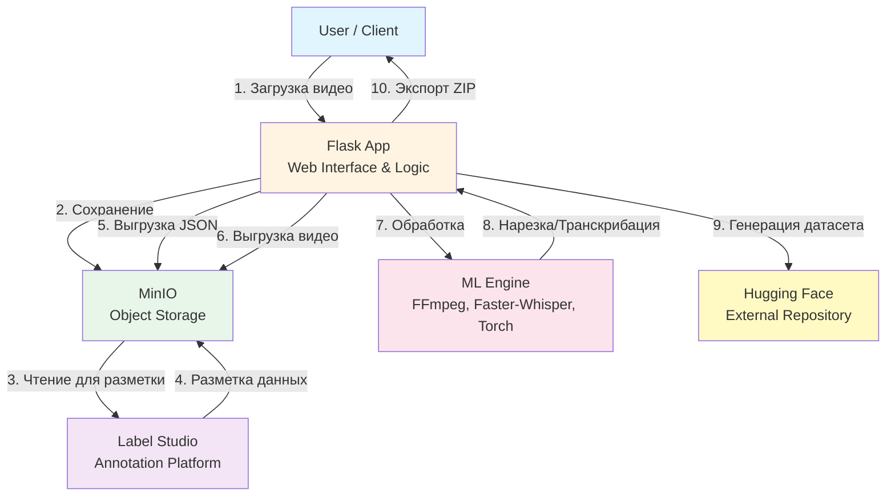
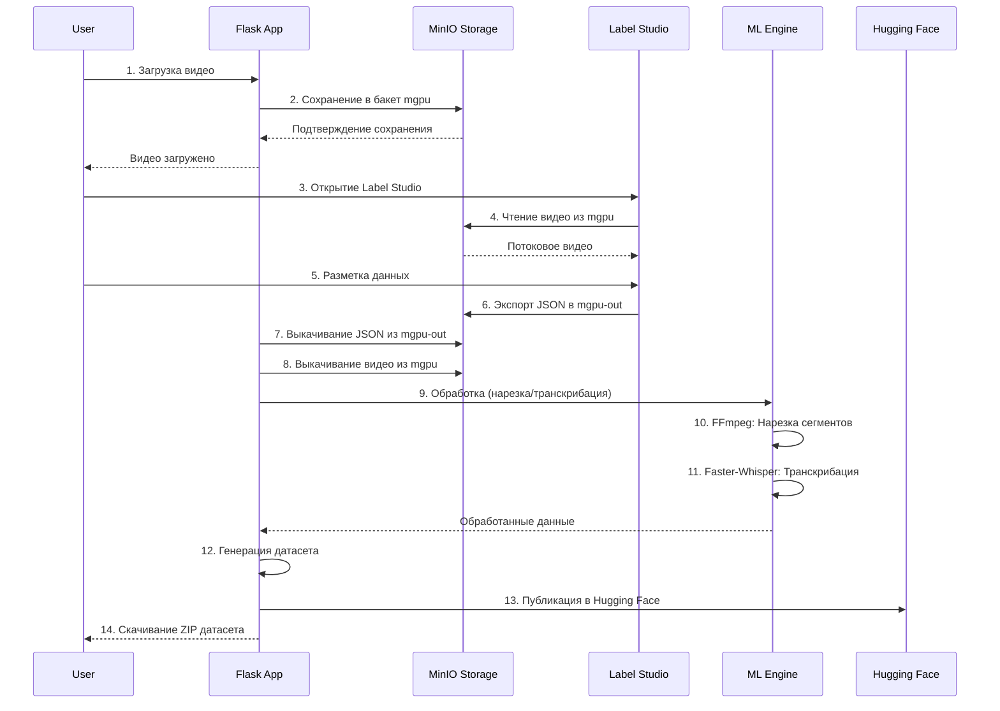
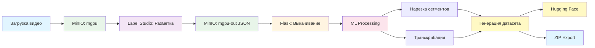

# Pedagogical Pattern Infrastructure (PPI)

## Общее описание

**Pedagogical Pattern Infrastructure (PPI)** — платформа для анализа видео учебных процессов, обеспечивающая полный цикл обработки от сырого видео до готового датасета. Система предназначена для автоматизации процесса разметки, транскрибации и подготовки данных для машинного обучения в образовательной сфере.

Система развернута на **Ubuntu 22.04** в **монолитной архитектуре** (Native, без использования Docker). Все компоненты работают нативно в операционной системе.

## Доступы и Конфигурация (As Is)

### MinIO Object Storage

| Параметр | Значение |
|----------|----------|
| **Web Console URL** | http://192.168.0.33:9000 |
| **API URL** | <br>http://192.168.0.33:9000 |
| **User** | mgpu |
| **Password** |  |
| **Access Key** |  |
| **Secret Key** |  |
| **Region** | us-east-1 |

### Label Studio

| Параметр | Значение |
|----------|----------|
| **URL** | http://192.168.0.33:11001 |
| **User** |  |
| **Password** |  |

### Flask Web Application

| Параметр | Значение |
|----------|----------|
| **URL** | http://192.168.0.33:5000 |

### Настройки бакетов (Buckets Config)

| Бакет | Назначение | Region |
|-------|------------|--------|
| **mgpu** | Входящее хранилище (исходные видео) | us-east-1 |
| **mgpu-out** | Исходящее хранилище (JSON после разметки) | us-east-1 |

**Pre-signed URLs**: Выключено (OFF)

## Архитектура системы



## Поток работы пользователя



### Детальный процесс обработки



## Технологический стек

### Операционная система и базовое окружение
- **OS**: Ubuntu 22.04 LTS
- **Language**: Python 3.10
- **Package Manager**: pip

### Web Framework
- **Flask**: Веб-фреймворк для REST API и веб-интерфейса
- **Gunicorn**: WSGI HTTP сервер для production

### Хранилище данных
- **MinIO**: S3-совместимое объектное хранилище
  - Бакет `mgpu`: исходные видео
  - Бакет `mgpu-out`: JSON результаты разметки

### Платформа разметки
- **Label Studio**: Инструмент для аннотации и разметки данных
  - Порт: 11001
  - Локальное обслуживание файлов: включено

### ML/Processing компоненты
- **faster-whisper**: Модель для транскрибации аудио/видео
  - Основана на OpenAI Whisper
  - Оптимизирована для быстрой обработки
- **opencv-python**: Обработка и анализ видео
  - Извлечение кадров
  - Обработка изображений
- **moviepy**: Нарезка и обработка видео
  - Создание сегментов
  - Экспорт кадров
- **torch**: PyTorch (CPU версия) для ML операций
- **ffmpeg**: Обработка мультимедиа
  - Конвертация форматов
  - Нарезка видео

### Публикация и экспорт
- **huggingface_hub**: Интеграция с Hugging Face
  - Загрузка датасетов
  - Управление репозиториями

## Структура датасета

Генерируемый датасет имеет следующую структуру:

```
dataset/
├── annotations/          # JSON файлы с разметкой
│   ├── project_1.json
│   ├── project_2.json
│   └── ...
├── frames/              # Извлеченные кадры из видео
│   ├── video_1/
│   │   ├── frame_0001.jpg
│   │   ├── frame_0002.jpg
│   │   └── ...
│   └── video_2/
│       └── ...
├── segments/            # Нарезанные сегменты видео
│   ├── video_1/
│   │   ├── segment_001.mp4
│   │   ├── segment_002.mp4
│   │   └── ...
│   └── video_2/
│       └── ...
└── transcriptions/      # Транскрибированный текст
    ├── video_1/
    │   ├── segment_001.txt
    │   ├── segment_002.txt
    │   └── ...
    └── video_2/
        └── ...
```

### Описание компонентов датасета

- **annotations/**: Содержит JSON файлы с полной разметкой из Label Studio. Каждый файл соответствует проекту разметки и включает все аннотации, метаданные и связи между объектами.

- **frames/**: Извлеченные кадры из исходных видео. Кадры организованы по видеофайлам и могут использоваться для обучения моделей компьютерного зрения или визуального анализа.

- **segments/**: Нарезанные сегменты видео на основе разметки. Каждый сегмент представляет отдельный учебный паттерн или событие, выделенное в процессе аннотации.

- **transcriptions/**: Текстовые транскрипции аудиодорожек сегментов. Создаются с помощью faster-whisper и содержат распознанную речь в текстовом формате.

## Рабочая директория проекта

```
/home/ppi/Downloads/ppi_25/
├── minio/              # Данные MinIO (объектное хранилище)
├── label_studio/       # Рабочая директория Label Studio
├── venv/               # Python виртуальное окружение
├── setup_env.sh        # Скрипт установки базового окружения
├── setup_ls_app.sh     # Скрипт установки Label Studio
├── readme_service_ppi.md  # Техническая документация по установке
└── ppi.md              # Этот файл (общая документация системы)
```

## Безопасность

⚠️ **Важно**: Данный документ содержит реальные учетные данные для доступа к системе. 

**Рекомендации для продакшена:**
- Регулярная смена паролей и ключей доступа
- Использование HTTPS для всех веб-интерфейсов
- Ограничение доступа по IP через файрвол
- Настройка регулярных бэкапов данных
- Мониторинг логов на предмет подозрительной активности
- Использование переменных окружения для хранения секретов

## Контакты и поддержка

Обращайтесь к команде разработки PPI

---
*Документация обновлена: 08-12-2025*

