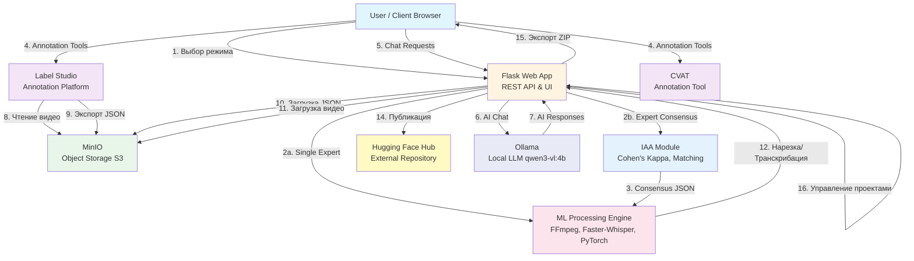
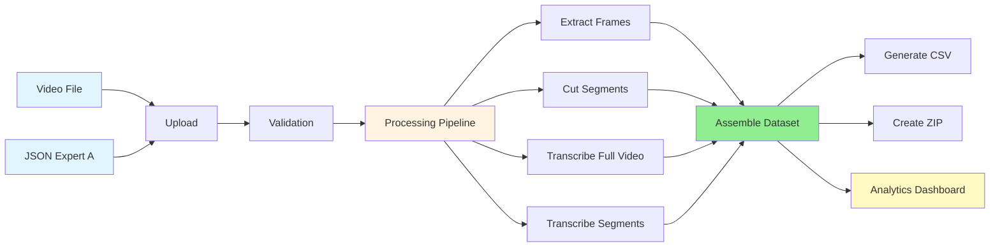
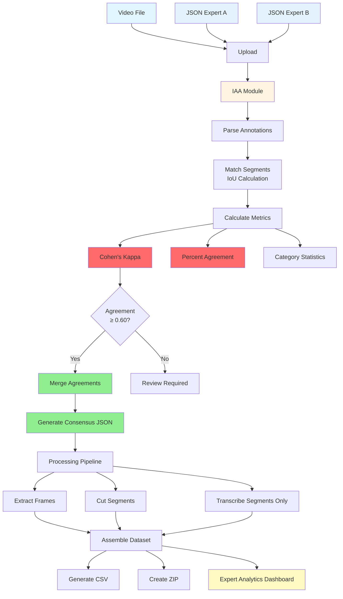

# Pedagogical Pattern Infrastructure (PPI)

## Введение

**Pedagogical Pattern Infrastructure (PPI)** — комплексная платформа для анализа видео учебных процессов, обеспечивающая полный автоматизированный цикл обработки от исходного видео до готового датасета для машинного обучения. Система поддерживает два режима работы: стандартный режим с одним экспертом и режим межэкспертного согласования (Inter-Annotator Agreement, IAA) для сравнения аннотаций двух экспертов. Дополнительно интегрирован функционал чата с данными/документами на основе локальной LLM (Ollama) для интерактивного взаимодействия с системой.

Система развернута на **Ubuntu 22.04** и **Windows 10/11** в **монолитной архитектуре** (Native, без использования Docker). Все компоненты работают нативно в операционной системе, что обеспечивает простоту развертывания и управления.

### Технологический стек

- **ОС**: Ubuntu 22.04 LTS / Windows 10/11
- **Python**: 3.10 (нативный интерпретатор)
- **Web Framework**: Flask 3.0+ с Gunicorn (Linux) или встроенным сервером (Windows)
- **Frontend**: Vanilla JavaScript (без фреймворков), Chart.js для визуализации
- **Storage**: MinIO (S3-совместимое объектное хранилище)
- **Annotation**: Label Studio 1.21.0
- **ML Processing**: 
  - FFmpeg (обработка видео)
  - Faster-Whisper (транскрибация)
  - PyTorch (CPU/CUDA версия)
  - OpenCV (обработка изображений)
  - MoviePy (нарезка видео)
- **Statistics**: scikit-learn (Cohen's Kappa для IAA)
- **Publishing**: Hugging Face Hub
- **AI/Chat**: 
  - Ollama (локальная LLM)
  - OpenAI API Client (для совместимости с Ollama)
  - qwen3-vl:4b (мультимодальная модель для чата)

## Режимы работы (Workflow Modes)

### 1. Single Expert Mode (Стандартный режим)

**Описание**: Стандартный пайплайн обработки для одного эксперта-аннотатора.

**Входные данные**:
- 1 видеофайл (MP4, MOV, MKV, AVI, WebM)
- 1 JSON файл с аннотациями (экспорт из Label Studio)

**Процесс**:
1. Загрузка видео и JSON файла
2. Валидация аннотаций
3. Обработка:
   - Извлечение кадров (start, middle, end для каждого сегмента)
   - Нарезка видео на сегменты по временным меткам
   - Полная транскрибация видео (Faster-Whisper)
   - Транскрибация отдельных сегментов
4. Генерация датасета:
   - CSV файл с метаданными
   - Организованная структура папок
   - ZIP архив
5. Аналитика:
   - Статистика по категориям
   - Визуализация распределения меток
   - Дашборд с графиками (Chart.js)

**Выходные данные**:
- Структурированный датасет в папке `processed_results/[task_id]/`
- CSV файл с метаданными
- ZIP архив для экспорта
- Статистика в `stats.json`
- Дашборд аналитики: `/analytics/<project_name>`

### 2. Expert Consensus Mode (IAA - Inter-Annotator Agreement)

**Описание**: Режим сравнения и слияния аннотаций двух экспертов с расчетом метрик согласованности.

**Входные данные**:
- 1 видеофайл (MP4, MOV, MKV, AVI, WebM)
- 2 JSON файла с аннотациями:
  - JSON Expert A (первый эксперт)
  - JSON Expert B (второй эксперт)

**Процесс**:
1. Загрузка видео и двух JSON файлов
2. **Проверка согласованности (Check Agreement)**:
   - Парсинг аннотаций обоих экспертов
   - Сопоставление сегментов по временным меткам (IoU)
   - Расчет метрик IAA:
     - Cohen's Kappa (мультиклассовый)
     - Процент согласия (Percent Agreement)
     - Количество согласий/разногласий/пропусков
   - Детальная статистика по категориям
3. **Слияние аннотаций (Merge Agreements)**:
   - Объединение только согласованных сегментов
   - Усреднение временных меток
   - Объединение текстовых полей (action_description, context_and_comments)
   - Генерация `consensus.json` с полной структурой Label Studio
   - Сохранение `iaa_stats.json` с детальной статистикой
4. **Обработка консенсуса**:
   - Транскрибация только сегментов (без полной транскрибации видео)
   - Извлечение кадров и нарезка сегментов
   - Генерация датасета на основе consensus.json
5. **Аналитика**:
   - Специальный дашборд для сравнения экспертов
   - Визуализация Cohen's Kappa (Gauge)
   - Графики сравнения по категориям
   - Детализация согласий/разногласий

**Выходные данные**:
- Структурированный датасет в папке `processed_results/[task_id]/`
- `consensus.json` — объединенные аннотации
- `iaa_stats.json` — детальная статистика IAA
- CSV файл с метаданными
- ZIP архив для экспорта
- Дашборд аналитики: `/analytics/expert/<project_name>`

**Метрики IAA**:
- **Cohen's Kappa**: Мультиклассовый коэффициент согласованности (0.0 - 1.0)
  - ≥ 0.80: Excellent Agreement
  - ≥ 0.60: Good Agreement
  - ≥ 0.40: Moderate Agreement
  - < 0.40: Poor Agreement
- **Percent Agreement**: Процент полностью совпадающих сегментов
- **Category Statistics**: Детальная статистика по каждой категории (Agreement/Disagreement/Miss)

## Структура проекта


## Архитектура системы



## Диаграммы режимов работы

### 👤 1 Expert (Standard) - Стандартный режим

**Назначение**: Стандартный режим для проверки корректности размеченного видео одним экспертом. Используется для валидации аннотаций и создания датасета из одного источника разметки.



**Описание процесса**:
1. **Загрузка**: Пользователь загружает одно видео и один JSON файл с аннотациями
2. **Валидация**: Система проверяет корректность структуры JSON и наличие временных меток
3. **Обработка**: 
   - Извлечение кадров из каждого сегмента (start, middle, end)
   - Нарезка видео на сегменты по временным меткам из аннотаций
   - Полная транскрибация всего видео с помощью Faster-Whisper
   - Транскрибация отдельных сегментов для детального анализа
4. **Генерация датасета**: Сборка структурированного датасета с метаданными
5. **Аналитика**: Визуализация статистики по категориям и распределению меток

**Особенности**:
- Полная транскрибация видео для контекстного анализа
- Стандартная структура датасета с полными метаданными
- Дашборд аналитики с графиками распределения по категориям

### 👥 2 Experts (IAA) - Режим межэкспертного согласования

**Назначение**: Режим для оценки межэкспертной согласованности между двумя аннотаторами на основе коэффициента Каппа-Коэна и пересечения меток на временном интервале. Используется для валидации качества разметки и создания консенсусного датасета.



**Описание процесса**:
1. **Загрузка**: Пользователь загружает одно видео и два JSON файла от разных экспертов
2. **Парсинг аннотаций**: Извлечение сегментов с временными метками и категориями из обоих JSON
3. **Сопоставление сегментов**: Расчет пересечения временных интервалов (IoU - Intersection over Union)
4. **Расчет метрик IAA**:
   - **Cohen's Kappa**: Мультиклассовый коэффициент согласованности
   - **Percent Agreement**: Процент полностью совпадающих сегментов
   - **Category Statistics**: Детальная статистика по каждой категории
5. **Слияние аннотаций**: Объединение только согласованных сегментов (если Kappa ≥ 0.60)
6. **Обработка консенсуса**: Обработка только согласованных сегментов (без полной транскрибации)
7. **Аналитика**: Специальный дашборд с визуализацией метрик согласованности

**Формулы расчета метрик**:

**1. Intersection over Union (IoU) для временных интервалов**:

\[
IoU(A, B) = \frac{\text{Intersection}(A, B)}{\text{Union}(A, B)} = \frac{\max(0, \min(A_{end}, B_{end}) - \max(A_{start}, B_{start}))}{\max(A_{end}, B_{end}) - \min(A_{start}, B_{start})}
\]

где:
- \(A_{start}, A_{end}\) — начало и конец сегмента эксперта A
- \(B_{start}, B_{end}\) — начало и конец сегмента эксперта B
- Сегменты считаются совпадающими, если \(IoU \geq 0.5\)

**2. Cohen's Kappa (мультиклассовый)**:

\[
\kappa = \frac{p_o - p_e}{1 - p_e}
\]

где:
- \(p_o\) — наблюдаемая доля согласия (observed agreement)
- \(p_e\) — ожидаемая доля согласия по случайности (expected agreement)

Для мультиклассовой задачи:
\[
p_o = \frac{1}{N} \sum_{i=1}^{k} n_{ii}
\]

\[
p_e = \sum_{i=1}^{k} \frac{n_{i+} \cdot n_{+i}}{N^2}
\]

где:
- \(N\) — общее количество сегментов
- \(k\) — количество уникальных категорий
- \(n_{ii}\) — количество сегментов, где оба эксперта выбрали категорию \(i\)
- \(n_{i+}\) — количество сегментов, где эксперт A выбрал категорию \(i\)
- \(n_{+i}\) — количество сегментов, где эксперт B выбрал категорию \(i\)

**3. Percent Agreement**:

\[
\text{Percent Agreement} = \frac{\text{Agreements}}{\text{Total Segments}} \times 100\%
\]

где:
- **Agreements** — количество сегментов с полным совпадением (IoU ≥ 0.5 и одинаковые категории)
- **Total Segments** — общее количество уникальных сегментов (с учетом пропусков)

**4. Усреднение временных меток при слиянии**:

\[
\text{start}_{consensus} = \frac{\text{start}_A + \text{start}_B}{2}
\]

\[
\text{end}_{consensus} = \frac{\text{end}_A + \text{end}_B}{2}
\]

**Интерпретация Cohen's Kappa**:
- \(\kappa \geq 0.80\): **Excellent Agreement** — отличная согласованность
- \(0.60 \leq \kappa < 0.80\): **Good Agreement** — хорошая согласованность
- \(0.40 \leq \kappa < 0.60\): **Moderate Agreement** — умеренная согласованность
- \(\kappa < 0.40\): **Poor Agreement** — низкая согласованность, требуется пересмотр разметки

**Особенности**:
- Транскрибация только сегментов (оптимизация производительности)
- Детальная статистика по категориям с визуализацией согласий/разногласий
- Автоматическое слияние только при высокой согласованности (Kappa ≥ 0.60)
- Специальный дашборд с Kappa Gauge и графиками сравнения

### 3. Chat Mode (Режим чата с AI ассистентом)

**Описание**: Интерактивный режим для общения с AI ассистентом на основе локальной LLM (Ollama). Поддерживает текстовые и мультимодальные запросы (текст + изображение) для получения помощи в работе с системой, анализа данных и документов.

**Технологии**:
- **Ollama**: Локальный сервер LLM на порту 11434
- **Модель**: qwen3-vl:4b (мультимодальная модель с поддержкой изображений)
- **API**: OpenAI-совместимый интерфейс через библиотеку `openai`

**Функциональность**:
1. **Текстовый чат**: Вопросы и ответы на естественном языке
2. **Мультимодальный чат**: Загрузка изображений для анализа (превью кадров, графики, скриншоты)
3. **Выбор агентов**: Различные специализированные агенты:
   - **Ask** (qwen3-vl:4b) — основной агент для общих вопросов
   - **Annotator** — AI-агент для автоматической разметки
   - **Omni** — Мультимодальный агент
   - **QA** — Проверка качества разметки
   - **Summary** — Генерация итогов урока
   - **Translator** — Перевод контента

**Интерфейсы**:
- **Боковая панель**: Встроенный чат в главной странице (открывается через меню "Agent Mode")
- **Отдельная страница**: Полноэкранный чат по адресу `/chat/standalone`

**Процесс работы**:
1. Пользователь открывает чат через меню "🤖 Agent Mode" → выбирает агента
2. Вводит текстовое сообщение или загружает изображение
3. Flask приложение отправляет запрос в Ollama через OpenAI-совместимый API
4. Ollama обрабатывает запрос локально (без отправки данных в облако)
5. Ответ возвращается пользователю с поддержкой Markdown форматирования

**Особенности**:
- Полностью локальная обработка (данные не покидают сервер)
- Поддержка Markdown в ответах AI
- История чата сохраняется в сессии браузера
- Возможность открыть чат в отдельной вкладке
- Обработка ошибок подключения к Ollama с понятными сообщениями

## Описание интерфейса (UI Features)

### Header (Шапка приложения)

Шапка содержит навигационные элементы и инструменты:

**Элементы (слева направо):**
1. **Логотип** — изображение проекта
2. **🛠 Annotation Tools** (Dropdown меню)
   - **Label Studio** — открывает `http://192.168.0.33:8080` в новой вкладке
   - **CVAT** — открывает `https://cvat.ai` в новой вкладке
3. **📊 Analysis Mode** (Dropdown меню)
   - **👤 1 Expert (Standard)** — переключает в стандартный режим
   - **👥 2 Experts (IAA)** — переключает в режим межэкспертного согласования
4. **🤖 Agent Mode** (Dropdown меню) — **НОВОЕ**
   - **Ask (qwen3-vl:4b)** — открывает чат с основным AI агентом
   - **Annotator** — AI-агент для автоматической разметки
   - **Omni** — Мультимодальный агент
   - **QA** — Проверка качества разметки
   - **Summary** — Генерация итогов урока
   - **Translator** — Перевод контента
5. **⚙️ Service** (Dropdown меню)
   - **View Projects** — просмотр списка сохраненных проектов
   - **Clear All Projects** — удаление всех проектов с сервера
6. **📖 Guide** — открывает руководство пользователя
7. **GitHub Logo** — ссылка на репозиторий `https://github.com/BosenkoTM/ppi_mgpu`

### Зона загрузки данных (Drag & Drop Area)

Центральная область для загрузки файлов с двумя способами импорта:

**Функциональность:**
- **Drag & Drop** — перетаскивание файлов в область
- **📂 Browse Local Files** — открытие системного диалога выбора файлов
- **📂 Load Expert B JSON** — кнопка для загрузки второго JSON (только в режиме 2 Experts)
- **☁️ Import from S3** — подключение к MinIO и выбор файлов из облачного хранилища

**Поддерживаемые форматы:**
- Видео: MP4, MOV, MKV, AVI, WebM
- Аннотации: JSON (экспорт из Label Studio)

**Отображение загруженных файлов:**
- Информация о загруженном видео с возможностью удаления
- Информация о загруженном JSON (Expert A в режиме 2 Experts)
- Информация о загруженном JSON Expert B (только в режиме 2 Experts)

### Панель действий (Buttons Row)

**Режим 1 Expert (Standard):**
1. **Process** — запускает стандартную обработку
2. **Cancel** — отменяет обработку (появляется во время работы)
3. **Export Dataset** — экспорт датасета (появляется после обработки)
4. **Start New Project** — сброс интерфейса (появляется после обработки)

**Режим 2 Experts (IAA):**
1. **Check Agreement** — проверка согласованности между экспертами
2. **Merge Agreements** — слияние согласованных аннотаций (появляется после проверки)
3. **Start Processing** — запуск обработки consensus.json (появляется после слияния)
4. **Cancel** — отменяет обработку (появляется во время работы)
5. **Export Dataset** — экспорт датасета (появляется после обработки)
6. **Start New Project** — сброс интерфейса (появляется после обработки)

### Блок результата проверки согласованности (IAA Result)

**Отображается только в режиме 2 Experts после нажатия "Check Agreement":**

- **Cohen's Kappa**: Значение коэффициента с цветовой индикацией
- **Percent Agreement**: Процент согласия
- **Статистика**:
  - Количество согласий (Agreements)
  - Количество разногласий (Disagreements)
  - Количество пропусков (Misses)
- **Рекомендация**: Если Kappa ≥ 0.60, показывается кнопка "Merge Agreements"

### Прогресс-бар

**Отображение:**
- Полоса прогресса (0-100%)
- Текстовый статус с процентом выполнения
- **ETA (Estimated Time of Arrival)** — примерное время до завершения

**Стадии обработки:**
- `prepare` — подготовка данных
- `frames` — извлечение кадров
- `segments` — нарезка сегментов
- `transcribe` — транскрибация аудио (полная или только сегменты)
- `assemble` — сборка датасета
- `finish` — завершение
- `error` — ошибка
- `cancelled` — отменено пользователем

### Панель статуса процесса (Process Status)

Визуальная индикация этапов:
1. ✓/✗ Video loaded
2. ✓/✗ JSON annotations loaded (или "JSON Expert A & B loaded" в режиме 2 Experts)
3. ✓/✗ Processing completed
4. ✓/✗ Dataset ready for export

### AI Agent Chat Interface (Интерфейс чата с AI ассистентом) — **НОВОЕ**

**Описание**: Боковая панель для интерактивного общения с AI ассистентом на основе локальной LLM (Ollama).

**Расположение**: 
- Открывается через меню "🤖 Agent Mode" в шапке приложения
- Скользит справа налево поверх основного контента
- Может быть открыта в отдельной вкладке через кнопку "↗" (открывает `/chat/standalone`)

**Элементы интерфейса**:

1. **Заголовок панели**:
   - Название "🤖 AI Assistant"
   - Кнопка "↗" — открыть в новой вкладке
   - Кнопка "🗑️" — очистить историю чата
   - Кнопка "×" — закрыть панель

2. **Выбор агента** (Select Agent):
   - Выпадающий список с доступными агентами:
     - **Ask** (qwen3-vl:4b) — активен по умолчанию, подключен к Ollama
     - **Annotator** — AI-агент для автоматической разметки
     - **Omni** — Мультимодальный агент
     - **QA** — Проверка качества разметки
     - **Summary** — Генерация итогов урока
     - **Translator** — Перевод контента

3. **Область сообщений** (Messages Area):
   - Отображение истории диалога
   - Сообщения пользователя справа (синий цвет)
   - Сообщения AI слева (серый цвет)
   - Поддержка Markdown форматирования в ответах AI
   - Статусное сообщение при первом открытии:
     - 🟢 "Connected to local Ollama (qwen3-vl:4b)" — для агента Ask
     - 🔴 "Server disconnected. Waiting for MCP connection..." — для других агентов

4. **Область ввода** (Input Area):
   - **Кнопка загрузки изображения** (📷):
     - Позволяет прикрепить изображение к сообщению
     - Поддерживает форматы: JPEG, PNG, GIF, WebP
     - Максимальный размер: 10 MB
     - Превью изображения отображается перед отправкой
   - **Текстовое поле** (Textarea):
     - Многострочный ввод
     - Placeholder: "Ask Qwen VL anything..." (для Ask) или "Type your message here..." (для других)
     - Отправка по Enter (Shift+Enter для новой строки)
   - **Кнопка отправки** (✈️):
     - Отправляет сообщение на сервер
     - Блокируется во время обработки запроса

**Функциональность**:
- **Текстовый чат**: Отправка текстовых сообщений и получение ответов от AI
- **Мультимодальный чат**: Загрузка изображений для анализа (кадры видео, графики, скриншоты)
- **История чата**: Сохранение истории диалога в сессии браузера
- **Очистка истории**: Кнопка "🗑️" очищает все сообщения
- **Обработка ошибок**: Понятные сообщения об ошибках подключения к Ollama

**Отдельная страница чата** (`/chat/standalone`):
- Полноэкранный интерфейс чата
- Те же функции, что и боковая панель
- Удобно для длительных диалогов
- Открывается в новой вкладке браузера

## Дашборды аналитики

### Стандартный дашборд (`/analytics/<project_name>`)

**Для проектов в режиме 1 Expert:**

- **Графики распределения**:
  - По субъектам (Subject)
  - По категориям (Category)
  - По педагогическим подкатегориям (Pedagogical Subcategory)
  - По коммуникативным модальностям (Communicative Modality)
- **Статистика**: Общее количество сегментов, распределение по категориям
- **Интерактивность**: Сворачиваемые карточки графиков, Chart.js визуализация

### Экспертный дашборд (`/analytics/expert/<project_name>`)

**Для проектов в режиме 2 Experts:**

- **Kappa Gauge**: Визуализация Cohen's Kappa с цветовым кодированием
  - Excellent (≥0.80) — зеленый
  - Good (≥0.60) — светло-зеленый
  - Moderate (≥0.40) — желтый
  - Poor (<0.40) — красный
- **Общая статистика**:
  - Expert A Total
  - Expert B Total
  - Agreements (зеленый)
  - Disagreements (красный)
  - Percent Agreement
- **График 1: Overall Comparison** (Bar Chart)
  - Expert A Total, Expert B Total, Consensus Matches
- **Графики 2-4: Детализация по категориям** (Stacked Bar Chart)
  - Pedagogical Actions
  - Communicative Modalities
  - Subject (Initiator)
  - Каждый бар состоит из 3 сегментов:
    - 🟩 Agreement (зеленый) — оба эксперта выбрали
    - 🟥 Disagreement (красный) — пересечение по времени, но разные категории
    - 🟨 Miss/Unique (желтый) — метка есть только у одного эксперта

## API и функциональность

### REST API Endpoints

#### Основные эндпоинты

| Метод | Путь | Описание |
|-------|------|----------|
| `GET` | `/` | Главная страница приложения |
| `POST` | `/api/upload` | Загрузка видео или JSON файлов |
| `POST` | `/api/process` | Запуск обработки видео (стандартный режим) |
| `POST` | `/api/process/expert` | Запуск обработки consensus.json (экспертный режим) |
| `GET` | `/api/progress/<task_id>` | Получение прогресса обработки |
| `POST` | `/api/cancel` | Отмена обработки и удаление файлов |

#### Экспертный режим (IAA)

| Метод | Путь | Описание |
|-------|------|----------|
| `POST` | `/api/expert/check` | Проверка согласованности между двумя JSON |
| `POST` | `/api/expert/merge` | Слияние аннотаций в consensus.json |

#### Аналитика

| Метод | Путь | Описание |
|-------|------|----------|
| `GET` | `/analytics/<project_name>` | Дашборд аналитики (стандартный режим) |
| `GET` | `/analytics/expert/<project_name>` | Дашборд аналитики (экспертный режим) |

#### Управление проектами

| Метод | Путь | Описание |
|-------|------|----------|
| `GET` | `/api/projects` | Получение списка всех проектов |
| `DELETE` | `/api/project` | Удаление конкретного проекта по task_id |
| `DELETE` | `/api/projects/all` | Удаление всех проектов |

#### Интеграция с S3/MinIO

| Метод | Путь | Описание |
|-------|------|----------|
| `POST` | `/api/cloud/connect` | Подключение к S3-совместимому хранилищу |
| `GET` | `/api/cloud/videos` | Получение списка видео из бакета |
| `POST` | `/api/cloud/download` | Скачивание видео из бакета |
| `POST` | `/api/cloud/upload` | Загрузка ZIP архива в бакет |

#### Публикация и экспорт

| Метод | Путь | Описание |
|-------|------|----------|
| `POST` | `/api/publish` | Публикация датасета на Hugging Face |
| `POST` | `/api/save/zip` | Скачивание ZIP архива датасета |

#### AI Chat (Чат с AI ассистентом) — **НОВОЕ**

| Метод | Путь | Описание |
|-------|------|----------|
| `POST` | `/api/agent/chat` | Отправка сообщения в AI агент через Ollama. Поддерживает текстовые и мультимодальные запросы (текст + изображение в Base64) |
| `GET` | `/chat/standalone` | Полноэкранная страница чата AI ассистента |

## Структура датасета

Генерируемый датасет имеет следующую структуру:

```
[task_id]/
├── annotations/
│   └── annotation.json          # Полная разметка из Label Studio
├── frames/                      # Извлеченные кадры из видео
│   ├── start/                   # Кадры в начале сегментов
│   ├── middle/                  # Кадры в середине сегментов
│   └── end/                     # Кадры в конце сегментов
├── segments/                    # Нарезанные сегменты видео
│   ├── label_0.00_5.23.mp4
│   └── ...
├── transcriptions/              # Транскрибированный текст
│   ├── full_transcription.txt   # Полная транскрипция (только в стандартном режиме)
│   └── segments/                # Транскрипции по сегментам
│       ├── segment_0.00_5.23.txt
│       └── ...
├── iaa_stats.json               # Статистика IAA (только для экспертного режима)
├── consensus.json               # Объединенные аннотации (только для экспертного режима)
├── dataset.csv                  # CSV с метаданными (8 полей)
├── metadata.json                # Метаданные проекта
├── project_info.json            # Информация о проекте (is_expert_consensus флаг)
├── stats.json                   # Статистика по категориям
├── README.md                    # Описание датасета для Hugging Face
└── dataset.zip                  # ZIP архив всего датасета
```

### Описание компонентов датасета

- **annotations/**: JSON файлы с полной разметкой из Label Studio
- **frames/**: Извлеченные кадры, организованные по позиции в сегменте
- **segments/**: Нарезанные сегменты видео на основе временных меток
- **transcriptions/**: Текстовые транскрипции (полная + по сегментам в стандартном режиме, только по сегментам в экспертном)
- **iaa_stats.json**: Детальная статистика межэкспертного согласования (только для экспертного режима)
- **consensus.json**: Объединенные аннотации двух экспертов (только для экспертного режима)
- **dataset.csv**: Основной файл метаданных с 8 полями

## Установка и запуск

### Для Linux (Ubuntu 22.04)

#### Первоначальная установка

1. **Базовое окружение и MinIO:**
```bash
cd /home/ppi/Downloads/ppi_25
chmod +x setup_env.sh
sudo ./setup_env.sh
```

2. **Label Studio и зависимости:**
```bash
chmod +x setup_ls_app.sh
sudo ./setup_ls_app.sh
```

3. **Зависимости Flask приложения:**
```bash
cd /home/ppi/Downloads/ppi_25/ppi
chmod +x fix_requirements.sh
./fix_requirements.sh
```

#### Запуск сервисов

**MinIO:**
```bash
sudo systemctl start minio
sudo systemctl status minio
```

**Label Studio:**
```bash
sudo systemctl start label-studio
sudo systemctl status label-studio
```

**Flask приложение:**
```bash
cd /home/ppi/Downloads/ppi_25/ppi
./run_app.sh
```

### Для Windows 10/11

#### Предварительные требования

- PowerShell 5.1 или выше
- Python 3.10 или выше
- FFmpeg (см. инструкции по установке)

#### Настройка ExecutionPolicy (если требуется)

```powershell
Set-ExecutionPolicy -ExecutionPolicy RemoteSigned -Scope CurrentUser
```

#### Запуск Flask приложения

```powershell
cd E:\MGPU\ppi_fimal\ppi_25\ppi
.\start_app.ps1
```

Скрипт `start_app.ps1` автоматически:
- Проверяет наличие Python 3.10+
- Создает виртуальное окружение `venv` (если отсутствует)
- Активирует виртуальное окружение
- Устанавливает зависимости из `requirements.txt`
- Устанавливает PyTorch с поддержкой CUDA (если доступно)
- Запускает Flask приложение

#### Установка и запуск Ollama (Local LLM)

**Для работы чата с AI ассистентом требуется установка Ollama:**

**Windows:**
1. Скачайте установщик с официального сайта: https://ollama.com/download
2. Установите Ollama, следуя инструкциям установщика
3. После установки Ollama автоматически запускается как сервис

**Linux (Ubuntu 22.04):**
```bash
# Установка Ollama
curl -fsSL https://ollama.com/install.sh | sh

# Запуск Ollama сервера
ollama serve
```

**Загрузка модели qwen3-vl:4b:**
```bash
# После установки Ollama загрузите модель
ollama pull qwen3-vl:4b
```

**Проверка работы Ollama:**
```bash
# Проверка статуса
ollama list

# Тестовый запрос
ollama run qwen3-vl:4b "Hello, how are you?"
```

**Важно:**
- Ollama должен быть запущен перед использованием чата в PPI
- По умолчанию Ollama работает на порту 11434
- Модель qwen3-vl:4b требует примерно 4-6 GB RAM
- Для мультимодальных запросов (с изображениями) рекомендуется иметь не менее 8 GB RAM

**Установка Python зависимостей для чата:**
```bash
# В виртуальном окружении проекта
pip install openai requests
```

Примечание: Библиотека `openai` используется для совместимости с Ollama API (OpenAI-совместимый интерфейс), а не для работы с облачным OpenAI API.

**Внешние сервисы (на Ubuntu сервере):**
- **Label Studio**: http://192.168.0.33:8080
- **MinIO API**: http://192.168.0.33:9000
- **MinIO Console**: http://192.168.0.33:9001

**Flask приложение:**
- Запускается на http://127.0.0.1:5000 (по умолчанию)

**Ollama (Local LLM):**
- Запускается на http://localhost:11434 (по умолчанию)
- Используется модель qwen3-vl:4b для чата

## Доступы и конфигурация

### MinIO Object Storage

| Параметр | Значение |
|----------|----------|
| **Web Console URL** | http://192.168.0.33:9001 |
| **API URL** | http://192.168.0.33:9000 |
| **User** | mgpu |
| **Access Key** | (см. конфигурацию) |
| **Secret Key** | (см. конфигурацию) |
| **Region** | us-east-1 |

### Label Studio

| Параметр | Значение |
|----------|----------|
| **URL** | http://192.168.0.33:8080 |
| **Systemd Service** | `label-studio.service` |
| **Рабочая директория** | `/home/ppi/Downloads/ppi_25/label_studio` |
| **Порт** | 11001 (внешний), 8080 (локальный) |

### Flask Web Application

| Параметр | Значение |
|----------|----------|
| **URL** | http://localhost:5000 |
| **Порт** | 5000 |
| **Максимальный размер файла** | 2 GB |

### Ollama (Local LLM)

| Параметр | Значение |
|----------|----------|
| **API URL** | http://localhost:11434/v1 |
| **Порт** | 11434 |
| **Модель по умолчанию** | qwen3-vl:4b |
| **Протокол** | OpenAI-совместимый API |
| **Требования RAM** | 4-6 GB (базовая модель), 8+ GB (мультимодальные запросы) |

### Настройки бакетов MinIO

| Бакет | Назначение | Region |
|-------|------------|--------|
| **mgpu** | Входящее хранилище (исходные видео) | us-east-1 |
| **mgpu-out** | Исходящее хранилище (JSON после разметки) | us-east-1 |

## Безопасность

⚠️ **Важные рекомендации для продакшена:**

1. **Измените пароли MinIO** на сложные и уникальные
2. **Измените пароль Label Studio** на более безопасный
3. **Настройте файрвол** для ограничения доступа к портам
4. **Используйте HTTPS** для всех веб-интерфейсов
5. **Настройте регулярные бэкапы** данных MinIO и проектов
6. **Ограничьте доступ** к системе только для авторизованных пользователей
7. **Мониторьте логи** на предмет подозрительной активности
8. **Используйте переменные окружения** для хранения секретов вместо хардкода в коде

## Контакты и поддержка

Для вопросов и проблем обращайтесь к команде разработки PPI.

**Репозиторий проекта:** https://github.com/BosenkoTM/ppi_mgpu

---
*Документация обновлена: 2025*
