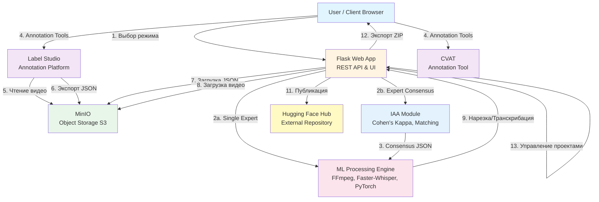
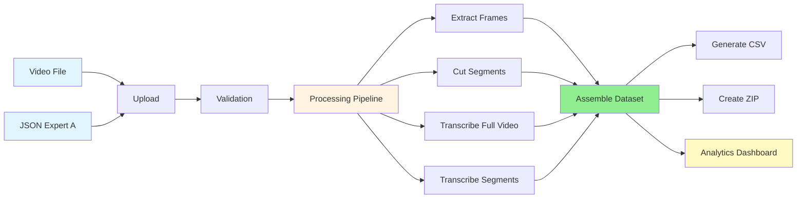
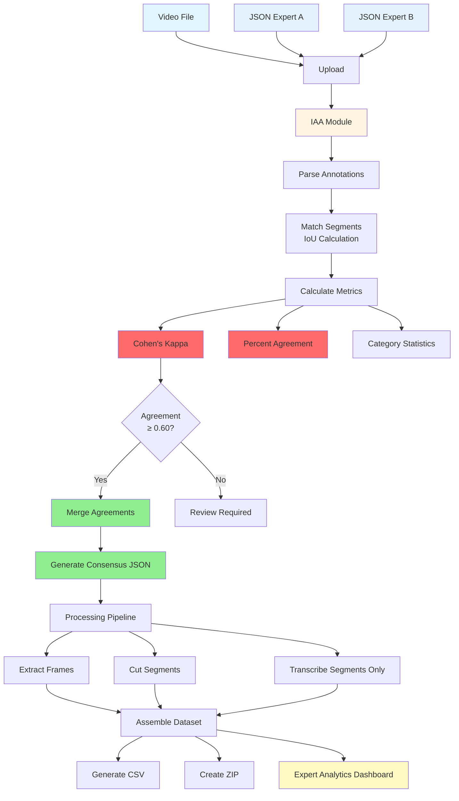

# Pedagogical Pattern Infrastructure (PPI)

## Введение

**Pedagogical Pattern Infrastructure (PPI)** — комплексная платформа для анализа видео учебных процессов, обеспечивающая полный автоматизированный цикл обработки от исходного видео до готового датасета для машинного обучения. Система поддерживает два режима работы: стандартный режим с одним экспертом и режим межэкспертного согласования (Inter-Annotator Agreement, IAA) для сравнения аннотаций двух экспертов.

Система развернута на **Ubuntu 22.04** и **Windows 10/11** в **монолитной архитектуре** (Native, без использования Docker). Все компоненты работают нативно в операционной системе, что обеспечивает простоту развертывания и управления.

### Технологический стек

- **ОС**: Ubuntu 22.04 LTS / Windows 10/11
- **Python**: 3.10 (нативный интерпретатор)
- **Web Framework**: Flask 3.0+ с Gunicorn (Linux) или встроенным сервером (Windows)
- **Frontend**: Vanilla JavaScript (без фреймворков), Chart.js для визуализации
- **Storage**: MinIO (S3-совместимое объектное хранилище)
- **Annotation**: Label Studio 1.21.0
- **ML Processing**: 
  - FFmpeg (обработка видео)
  - Faster-Whisper (транскрибация)
  - PyTorch (CPU/CUDA версия)
  - OpenCV (обработка изображений)
  - MoviePy (нарезка видео)
- **Statistics**: scikit-learn (Cohen's Kappa для IAA)
- **Publishing**: Hugging Face Hub

## Режимы работы (Workflow Modes)

### 1. Single Expert Mode (Стандартный режим)

**Описание**: Стандартный пайплайн обработки для одного эксперта-аннотатора.

**Входные данные**:
- 1 видеофайл (MP4, MOV, MKV, AVI, WebM)
- 1 JSON файл с аннотациями (экспорт из Label Studio)

**Процесс**:
1. Загрузка видео и JSON файла
2. Валидация аннотаций
3. Обработка:
   - Извлечение кадров (start, middle, end для каждого сегмента)
   - Нарезка видео на сегменты по временным меткам
   - Полная транскрибация видео (Faster-Whisper)
   - Транскрибация отдельных сегментов
4. Генерация датасета:
   - CSV файл с метаданными
   - Организованная структура папок
   - ZIP архив
5. Аналитика:
   - Статистика по категориям
   - Визуализация распределения меток
   - Дашборд с графиками (Chart.js)

**Выходные данные**:
- Структурированный датасет в папке `processed_results/[task_id]/`
- CSV файл с метаданными
- ZIP архив для экспорта
- Статистика в `stats.json`
- Дашборд аналитики: `/analytics/<project_name>`

### 2. Expert Consensus Mode (IAA - Inter-Annotator Agreement)

**Описание**: Режим сравнения и слияния аннотаций двух экспертов с расчетом метрик согласованности.

**Входные данные**:
- 1 видеофайл (MP4, MOV, MKV, AVI, WebM)
- 2 JSON файла с аннотациями:
  - JSON Expert A (первый эксперт)
  - JSON Expert B (второй эксперт)

**Процесс**:
1. Загрузка видео и двух JSON файлов
2. **Проверка согласованности (Check Agreement)**:
   - Парсинг аннотаций обоих экспертов
   - Сопоставление сегментов по временным меткам (IoU)
   - Расчет метрик IAA:
     - Cohen's Kappa (мультиклассовый)
     - Процент согласия (Percent Agreement)
     - Количество согласий/разногласий/пропусков
   - Детальная статистика по категориям
3. **Слияние аннотаций (Merge Agreements)**:
   - Объединение только согласованных сегментов
   - Усреднение временных меток
   - Объединение текстовых полей (action_description, context_and_comments)
   - Генерация `consensus.json` с полной структурой Label Studio
   - Сохранение `iaa_stats.json` с детальной статистикой
4. **Обработка консенсуса**:
   - Транскрибация только сегментов (без полной транскрибации видео)
   - Извлечение кадров и нарезка сегментов
   - Генерация датасета на основе consensus.json
5. **Аналитика**:
   - Специальный дашборд для сравнения экспертов
   - Визуализация Cohen's Kappa (Gauge)
   - Графики сравнения по категориям
   - Детализация согласий/разногласий

**Выходные данные**:
- Структурированный датасет в папке `processed_results/[task_id]/`
- `consensus.json` — объединенные аннотации
- `iaa_stats.json` — детальная статистика IAA
- CSV файл с метаданными
- ZIP архив для экспорта
- Дашборд аналитики: `/analytics/expert/<project_name>`

**Метрики IAA**:
- **Cohen's Kappa**: Мультиклассовый коэффициент согласованности (0.0 - 1.0)
  - ≥ 0.80: Excellent Agreement
  - ≥ 0.60: Good Agreement
  - ≥ 0.40: Moderate Agreement
  - < 0.40: Poor Agreement
- **Percent Agreement**: Процент полностью совпадающих сегментов
- **Category Statistics**: Детальная статистика по каждой категории (Agreement/Disagreement/Miss)

## Архитектура системы



## Диаграммы режимов работы

### 👤 1 Expert (Standard) - Стандартный режим

**Назначение**: Стандартный режим для проверки корректности размеченного видео одним экспертом. Используется для валидации аннотаций и создания датасета из одного источника разметки.



**Описание процесса**:
1. **Загрузка**: Пользователь загружает одно видео и один JSON файл с аннотациями
2. **Валидация**: Система проверяет корректность структуры JSON и наличие временных меток
3. **Обработка**: 
   - Извлечение кадров из каждого сегмента (start, middle, end)
   - Нарезка видео на сегменты по временным меткам из аннотаций
   - Полная транскрибация всего видео с помощью Faster-Whisper
   - Транскрибация отдельных сегментов для детального анализа
4. **Генерация датасета**: Сборка структурированного датасета с метаданными
5. **Аналитика**: Визуализация статистики по категориям и распределению меток

**Особенности**:
- Полная транскрибация видео для контекстного анализа
- Стандартная структура датасета с полными метаданными
- Дашборд аналитики с графиками распределения по категориям

### 👥 2 Experts (IAA) - Режим межэкспертного согласования

**Назначение**: Режим для оценки межэкспертной согласованности между двумя аннотаторами на основе коэффициента Каппа-Коэна и пересечения меток на временном интервале. Используется для валидации качества разметки и создания консенсусного датасета.



**Описание процесса**:
1. **Загрузка**: Пользователь загружает одно видео и два JSON файла от разных экспертов
2. **Парсинг аннотаций**: Извлечение сегментов с временными метками и категориями из обоих JSON
3. **Сопоставление сегментов**: Расчет пересечения временных интервалов (IoU - Intersection over Union)
4. **Расчет метрик IAA**:
   - **Cohen's Kappa**: Мультиклассовый коэффициент согласованности
   - **Percent Agreement**: Процент полностью совпадающих сегментов
   - **Category Statistics**: Детальная статистика по каждой категории
5. **Слияние аннотаций**: Объединение только согласованных сегментов (если Kappa ≥ 0.60)
6. **Обработка консенсуса**: Обработка только согласованных сегментов (без полной транскрибации)
7. **Аналитика**: Специальный дашборд с визуализацией метрик согласованности

**Формулы расчета метрик**:

**1. Intersection over Union (IoU) для временных интервалов**:

```
                    Intersection(A, B)
IoU(A, B) = ─────────────────────────────
                      Union(A, B)

             max(0, min(A_end, B_end) - max(A_start, B_start))
         = ───────────────────────────────────────────────────
                  max(A_end, B_end) - min(A_start, B_start)
```

где:
- `A_start`, `A_end` — начало и конец сегмента эксперта A
- `B_start`, `B_end` — начало и конец сегмента эксперта B
- Сегменты считаются совпадающими, если `IoU ≥ 0.5`

**2. Cohen's Kappa (мультиклассовый)**:

```
        Pₒ - Pₑ
κ = ─────────────
        1 - Pₑ
```

где:
- `Pₒ` — наблюдаемая доля согласия (observed agreement)
- `Pₑ` — ожидаемая доля согласия по случайности (expected agreement)

Для мультиклассовой задачи:

```
       1    k
Pₒ = ─── × Σ  nᵢᵢ
       N   i=1

       k    nᵢ₊ × n₊ᵢ
Pₑ =   Σ  ─────────────
      i=1      N²
```

где:
- `N` — общее количество сегментов
- `k` — количество уникальных категорий
- `nᵢᵢ` — количество сегментов, где оба эксперта выбрали категорию `i`
- `nᵢ₊` — количество сегментов, где эксперт A выбрал категорию `i`
- `n₊ᵢ` — количество сегментов, где эксперт B выбрал категорию `i`

**3. Percent Agreement**:

```
                         Agreements
Percent Agreement = ────────────────── × 100%
                     Total Segments
```

где:
- **Agreements** — количество сегментов с полным совпадением (IoU ≥ 0.5 и одинаковые категории)
- **Total Segments** — общее количество уникальных сегментов (с учетом пропусков)

**4. Усреднение временных меток при слиянии**:

```
                  start_A + start_B
start_consensus = ─────────────────
                         2

                  end_A + end_B
end_consensus   = ───────────────
                        2
```

**Интерпретация Cohen's Kappa**:
- `κ ≥ 0.80`: **Excellent Agreement** — отличная согласованность
- `0.60 ≤ κ < 0.80`: **Good Agreement** — хорошая согласованность
- `0.40 ≤ κ < 0.60`: **Moderate Agreement** — умеренная согласованность
- `κ < 0.40`: **Poor Agreement** — низкая согласованность, требуется пересмотр разметки

**Особенности**:
- Транскрибация только сегментов (оптимизация производительности)
- Детальная статистика по категориям с визуализацией согласий/разногласий
- Автоматическое слияние только при высокой согласованности (Kappa ≥ 0.60)
- Специальный дашборд с Kappa Gauge и графиками сравнения

## Описание интерфейса (UI Features)

### Header (Шапка приложения)

Шапка содержит навигационные элементы и инструменты:

**Элементы (слева направо):**
1. **Логотип** — изображение проекта
2. **🛠 Annotation Tools** (Dropdown меню)
   - **Label Studio** — открывает `http://192.168.0.33:8080` в новой вкладке
   - **CVAT** — открывает `https://cvat.ai` в новой вкладке
3. **📊 Analysis Mode** (Dropdown меню) — **НОВОЕ**
   - **👤 1 Expert (Standard)** — переключает в стандартный режим
   - **👥 2 Experts (IAA)** — переключает в режим межэкспертного согласования
4. **⚙️ Service** (Dropdown меню)
   - **View Projects** — просмотр списка сохраненных проектов
   - **Clear All Projects** — удаление всех проектов с сервера
5. **📖 Guide** — открывает руководство пользователя
6. **GitHub Logo** — ссылка на репозиторий `https://github.com/BosenkoTM/ppi_mgpu`

### Зона загрузки данных (Drag & Drop Area)

Центральная область для загрузки файлов с двумя способами импорта:

**Функциональность:**
- **Drag & Drop** — перетаскивание файлов в область
- **📂 Browse Local Files** — открытие системного диалога выбора файлов
- **📂 Load Expert B JSON** — кнопка для загрузки второго JSON (только в режиме 2 Experts)
- **☁️ Import from S3** — подключение к MinIO и выбор файлов из облачного хранилища

**Поддерживаемые форматы:**
- Видео: MP4, MOV, MKV, AVI, WebM
- Аннотации: JSON (экспорт из Label Studio)

**Отображение загруженных файлов:**
- Информация о загруженном видео с возможностью удаления
- Информация о загруженном JSON (Expert A в режиме 2 Experts)
- Информация о загруженном JSON Expert B (только в режиме 2 Experts)

### Панель действий (Buttons Row)

**Режим 1 Expert (Standard):**
1. **Process** — запускает стандартную обработку
2. **Cancel** — отменяет обработку (появляется во время работы)
3. **Export Dataset** — экспорт датасета (появляется после обработки)
4. **Start New Project** — сброс интерфейса (появляется после обработки)

**Режим 2 Experts (IAA):**
1. **Check Agreement** — проверка согласованности между экспертами
2. **Merge Agreements** — слияние согласованных аннотаций (появляется после проверки)
3. **Start Processing** — запуск обработки consensus.json (появляется после слияния)
4. **Cancel** — отменяет обработку (появляется во время работы)
5. **Export Dataset** — экспорт датасета (появляется после обработки)
6. **Start New Project** — сброс интерфейса (появляется после обработки)

### Блок результата проверки согласованности (IAA Result)

**Отображается только в режиме 2 Experts после нажатия "Check Agreement":**

- **Cohen's Kappa**: Значение коэффициента с цветовой индикацией
- **Percent Agreement**: Процент согласия
- **Статистика**:
  - Количество согласий (Agreements)
  - Количество разногласий (Disagreements)
  - Количество пропусков (Misses)
- **Рекомендация**: Если Kappa ≥ 0.60, показывается кнопка "Merge Agreements"

### Прогресс-бар

**Отображение:**
- Полоса прогресса (0-100%)
- Текстовый статус с процентом выполнения
- **ETA (Estimated Time of Arrival)** — примерное время до завершения

**Стадии обработки:**
- `prepare` — подготовка данных
- `frames` — извлечение кадров
- `segments` — нарезка сегментов
- `transcribe` — транскрибация аудио (полная или только сегменты)
- `assemble` — сборка датасета
- `finish` — завершение
- `error` — ошибка
- `cancelled` — отменено пользователем

### Панель статуса процесса (Process Status)

Визуальная индикация этапов:
1. ✓/✗ Video loaded
2. ✓/✗ JSON annotations loaded (или "JSON Expert A & B loaded" в режиме 2 Experts)
3. ✓/✗ Processing completed
4. ✓/✗ Dataset ready for export

## Дашборды аналитики

### Стандартный дашборд (`/analytics/<project_name>`)

**Для проектов в режиме 1 Expert:**

- **Графики распределения**:
  - По субъектам (Subject)
  - По категориям (Category)
  - По педагогическим подкатегориям (Pedagogical Subcategory)
  - По коммуникативным модальностям (Communicative Modality)
- **Статистика**: Общее количество сегментов, распределение по категориям
- **Интерактивность**: Сворачиваемые карточки графиков, Chart.js визуализация

### Экспертный дашборд (`/analytics/expert/<project_name>`)

**Для проектов в режиме 2 Experts:**

- **Kappa Gauge**: Визуализация Cohen's Kappa с цветовым кодированием
  - Excellent (≥0.80) — зеленый
  - Good (≥0.60) — светло-зеленый
  - Moderate (≥0.40) — желтый
  - Poor (<0.40) — красный
- **Общая статистика**:
  - Expert A Total
  - Expert B Total
  - Agreements (зеленый)
  - Disagreements (красный)
  - Percent Agreement
- **График 1: Overall Comparison** (Bar Chart)
  - Expert A Total, Expert B Total, Consensus Matches
- **Графики 2-4: Детализация по категориям** (Stacked Bar Chart)
  - Pedagogical Actions
  - Communicative Modalities
  - Subject (Initiator)
  - Каждый бар состоит из 3 сегментов:
    - 🟩 Agreement (зеленый) — оба эксперта выбрали
    - 🟥 Disagreement (красный) — пересечение по времени, но разные категории
    - 🟨 Miss/Unique (желтый) — метка есть только у одного эксперта

## API и функциональность

### REST API Endpoints

#### Основные эндпоинты

| Метод | Путь | Описание |
|-------|------|----------|
| `GET` | `/` | Главная страница приложения |
| `POST` | `/api/upload` | Загрузка видео или JSON файлов |
| `POST` | `/api/process` | Запуск обработки видео (стандартный режим) |
| `POST` | `/api/process/expert` | Запуск обработки consensus.json (экспертный режим) |
| `GET` | `/api/progress/<task_id>` | Получение прогресса обработки |
| `POST` | `/api/cancel` | Отмена обработки и удаление файлов |

#### Экспертный режим (IAA)

| Метод | Путь | Описание |
|-------|------|----------|
| `POST` | `/api/expert/check` | Проверка согласованности между двумя JSON |
| `POST` | `/api/expert/merge` | Слияние аннотаций в consensus.json |

#### Аналитика

| Метод | Путь | Описание |
|-------|------|----------|
| `GET` | `/analytics/<project_name>` | Дашборд аналитики (стандартный режим) |
| `GET` | `/analytics/expert/<project_name>` | Дашборд аналитики (экспертный режим) |

#### Управление проектами

| Метод | Путь | Описание |
|-------|------|----------|
| `GET` | `/api/projects` | Получение списка всех проектов |
| `DELETE` | `/api/project` | Удаление конкретного проекта по task_id |
| `DELETE` | `/api/projects/all` | Удаление всех проектов |

#### Интеграция с S3/MinIO

| Метод | Путь | Описание |
|-------|------|----------|
| `POST` | `/api/cloud/connect` | Подключение к S3-совместимому хранилищу |
| `GET` | `/api/cloud/videos` | Получение списка видео из бакета |
| `POST` | `/api/cloud/download` | Скачивание видео из бакета |
| `POST` | `/api/cloud/upload` | Загрузка ZIP архива в бакет |

#### Публикация и экспорт

| Метод | Путь | Описание |
|-------|------|----------|
| `POST` | `/api/publish` | Публикация датасета на Hugging Face |
| `POST` | `/api/save/zip` | Скачивание ZIP архива датасета |

## Структура датасета

Генерируемый датасет имеет следующую структуру:

```
[task_id]/
├── annotations/
│   └── annotation.json          # Полная разметка из Label Studio
├── frames/                      # Извлеченные кадры из видео
│   ├── start/                   # Кадры в начале сегментов
│   ├── middle/                  # Кадры в середине сегментов
│   └── end/                     # Кадры в конце сегментов
├── segments/                    # Нарезанные сегменты видео
│   ├── label_0.00_5.23.mp4
│   └── ...
├── transcriptions/              # Транскрибированный текст
│   ├── full_transcription.txt   # Полная транскрипция (только в стандартном режиме)
│   └── segments/                # Транскрипции по сегментам
│       ├── segment_0.00_5.23.txt
│       └── ...
├── iaa_stats.json               # Статистика IAA (только для экспертного режима)
├── consensus.json               # Объединенные аннотации (только для экспертного режима)
├── dataset.csv                  # CSV с метаданными (8 полей)
├── metadata.json                # Метаданные проекта
├── project_info.json            # Информация о проекте (is_expert_consensus флаг)
├── stats.json                   # Статистика по категориям
├── README.md                    # Описание датасета для Hugging Face
└── dataset.zip                  # ZIP архив всего датасета
```

### Описание компонентов датасета

- **annotations/**: JSON файлы с полной разметкой из Label Studio
- **frames/**: Извлеченные кадры, организованные по позиции в сегменте
- **segments/**: Нарезанные сегменты видео на основе временных меток
- **transcriptions/**: Текстовые транскрипции (полная + по сегментам в стандартном режиме, только по сегментам в экспертном)
- **iaa_stats.json**: Детальная статистика межэкспертного согласования (только для экспертного режима)
- **consensus.json**: Объединенные аннотации двух экспертов (только для экспертного режима)
- **dataset.csv**: Основной файл метаданных с 8 полями


## Безопасность

⚠️ **Важные рекомендации для продакшена:**

1. **Измените пароли MinIO** на сложные и уникальные
2. **Измените пароль Label Studio** на более безопасный
3. **Настройте файрвол** для ограничения доступа к портам
4. **Используйте HTTPS** для всех веб-интерфейсов
5. **Настройте регулярные бэкапы** данных MinIO и проектов
6. **Ограничьте доступ** к системе только для авторизованных пользователей
7. **Мониторьте логи** на предмет подозрительной активности
8. **Используйте переменные окружения** для хранения секретов вместо хардкода в коде

## Контакты и поддержка

Для вопросов и проблем обращайтесь к команде разработки PPI.

**Репозиторий проекта:** https://github.com/BosenkoTM/ppi_mgpu

---
*Документация обновлена: 2025*
