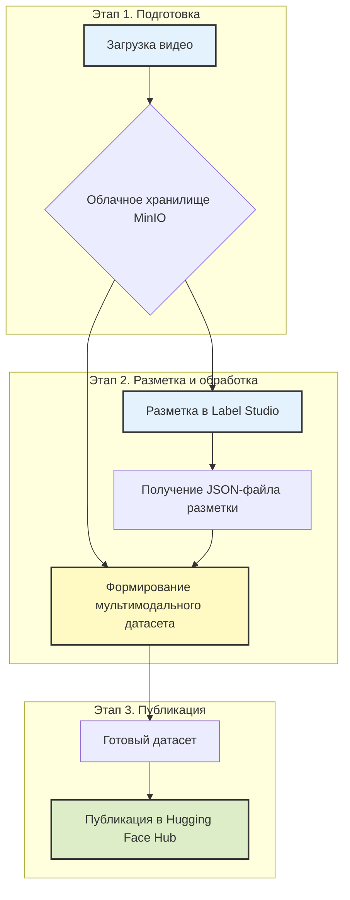

# **PPI Video Processing Platform**

**Pedagogical Pattern Infrastructure (PPI)** — это комплексная веб-платформа, предназначенная для анализа видеозаписей учебных процессов. Она позволяет исследователям и разработчикам проходить полный цикл от сырого видео до готового, структурированного датасета для обучения моделей машинного обучения.

**Цель проекта** — автоматизировать и упростить процесс выявления, разметки и анализа педагогических паттернов.

---

### **Общая схема работы**

Весь процесс построен на последовательном выполнении трех логических этапов, которые проводят пользователя от исходного видео до опубликованного датасета.



---

## **🚀 Рабочий процесс: от видео к датасету-эталону**

### **Этап 1. Загрузка и подготовка видео**

**Цель.** Безопасно загрузить исходное видео в централизованное хранилище и подготовить его к разметке.

**Как это работает:**
1.  **Аутентификация.** Пользователь входит в систему под своей учетной записью (`admin` или `DL-user`). Интерфейс предоставляет доступ к функциям в соответствии с правами.
2.  **Загрузка видео.** Через веб-интерфейс пользователь загружает видеофайл урока. Система автоматически извлекает из него аудиодорожку.
3.  **Хранение.** Видео и аудио сохраняются в облачное хранилище MinIO [настройка хранилищъ](admin_minio.md) в изолированную папку, привязанную к пользователю или задаче.

**Результат этапа.** Видеофайл и его аудиодорожка находятся в облаке и готовы для следующего шага.

---

### **Этап 2. Разметка в Label Studio и формирование датасета**

**Цель.** Разметить видео, выделив педагогические паттерны, и на основе этой разметки автоматически сгенерировать структурированный мультимодальный датасет.

**Как это работает:**
1.  **Разметка в Label Studio:**
    *   Система предоставляет временную защищенную ссылку (presigned URL) на загруженное видео. В `DemoDay`  все задачи будут доступны без предварительной загрузки.
    *   Пользователь импортирует видео по этой ссылке в Label Studio и, следуя [руководству по разметке](labelling_lstudio.md), аннотирует временные интервалы, соответствующие различным педагогическим паттернам.
    *   Результат разметки выгружается в виде **JSON-файла**.

2.  **Формирование датасета:**
    *   Специальный скрипт (например, в Google Colab) принимает на вход три компонента: **исходное видео**, **JSON-файл разметки** и **файл с описанием паттернов**.
    *   Для каждой аннотации в JSON-файле скрипт автоматически:
        *   **Вырезает видеофрагмент**, точно соответствующий времени паттерна.
        *   **Извлекает ключевой кадр** (фото), отражающий мимику или жест.
        *   **Транскрибирует речь** только из этого фрагмента.
        *   Собирает все это, **включая список всех выявленных в данном отрезке паттернов**, в единую запись датасета.

**Результат этапа.** Готовый к публикации датасет, состоящий из:
*   Папок с `изображениями`, `видеоклипами` и `текстами`.
*   Главного файла `metadata.jsonl`, который связывает все данные. **Каждая запись в этом файле теперь содержит список всех паттернов, относящихся к данному фрагменту.**

**Пример структуры одной записи в `metadata.jsonl`:**
```json
{
  "id": "pattern_42",
  "source_video": "03.mp4",
  "start_time": 141.22,
  "end_time": 143.55,
  "patterns": [
    {
      "type": "💖 П: Эмоциональная поддержка",
      "description": "Выражение вербального и невербального одобрения: улыбки, кивков головой, жестикуляции."
    },
    {
      "type": "🎯 П: Включение в процесс",
      "description": "Активные действия учителя по вовлечению учеников в учебную деятельность..."
    }
  ],
  "image_path": "images/pattern_42.jpg",
  "video_path": "videos/pattern_42.mp4",
  "text_path": "texts/pattern_42.txt"
}
```

---

### **Этап 3. Публикация датасета в Hugging Face**

**Цель.** Сделать готовый датасет доступным для всего мира или для исследовательской группы, опубликовав его на платформе Hugging Face.

**Как это работает:**
1.  **Подготовка к публикации.** Создается карточка датасета (README) с описанием его структуры, примеров использования и назначения.
2.  **Загрузка в Hub.** Вся структура папок, полученная на Этапе 2, загружается в новый репозиторий на Hugging Face Hub.
3.  **Публикация.** Датасет становится доступен по ссылке и может быть легко интегрирован в ML-пайплайны для обучения и анализа моделей.

**Пример готового датасета:**
*   [timbossm/ppi-mgpu-v01_25](https://huggingface.co/datasets/timbossm/ppi-mgpu-v01_25)

---

## **🛠️ Техническая документация для разработчиков**

<details>
<summary><b>🏗️ Архитектура системы</b></summary>

```
┌─────────────────────────────────────────────────────────────────┐
│                         КЛИЕНТ (Браузер)                        │
│  ┌──────────────────────────────────────────────────────────┐   │
│  │  HTML/CSS/JavaScript                                     │   │
│  │  - Модальное окно аутентификации                         │   │
│  │  - Пошаговый интерфейс (3 шага)                          │   │
│  │  - Загрузка файлов (локально или из MinIO)               │   │
│  │  - Отображение прогресса в реальном времени              │   │
│  │  - Модальное окно с presigned URL для Label Studio       │   │
│  │  - Управление файлами в облаке                           │   │
│  └──────────────────────────────────────────────────────────┘   │
└────────────────────────────┬────────────────────────────────────┘
                             │ HTTP/HTTPS
                             │ REST API
┌────────────────────────────▼────────────────────────────────────┐
│                    FLASK BACKEND (app.py)                       │
│  ┌──────────────────────────────────────────────────────────┐   │
│  │  Маршруты и обработка запросов                           │   │
│  │  - /api/login (аутентификация)                           │   │
│  │  - /api/process-video (защищен, асинхронная обработка)   │   │
│  │  - /api/status/<file_id> (статус обработки)              │   │
│  └──────────────────────────────────────────────────────────┘   │
│                                                                 │
│  ┌───────────────────┐  ┌──────────────────┐  ┌──────────────┐  │
│  │  video_processor  │  │  minio_handler   │  │    config    │  │
│  │  - extract_audio  │  │  - upload_file   │  │  - settings  │  │
│  │  - transcribe     │  │  - download      │  │  - logging   │  │
│  └───────────────────┘  └──────────────────┘  └──────────────┘  │
└────────────┬──────────────────┬──────────────────┬──────────────┘
             │                  │                  │
    ┌────────▼─────────┐ ┌──────▼──────┐ ┌────────▼────────┐
    │   FFmpeg         │ │   MinIO     │ │   Redis         │
    │   (Audio Extract)│ │  (Storage)  │ │  (Cache/Status) │
    └──────────────────┘ └─────────────┘ └─────────────────┘
```
</details>

<details>
<summary><b>📦 Структура проекта</b></summary>

```
landing/
├── app.py                 # Главный файл Flask приложения
├── config.py              # Конфигурация и настройки
├── minio_handler.py       # Работа с MinIO хранилищем
├── video_processor.py     # Обработка видео и транскрибация
├── requirements.txt       # Зависимости Python
├── users.json             # Учетные данные пользователей
├── README.md              # Документация (этот файл)
│
├── templates/
│   └── index.html         # Главная страница веб-интерфейса
│
├── static/
│   ├── css/
│   │   └── style.css      # Стили интерфейса
│   └── js/
│       └── script.js      # JavaScript логика
│
├── logo/                  # Логотипы и изображения
└── uploads/               # Временные загруженные файлы
```</details>

<details>
<summary><b>🔐 Аутентификация и авторизация</b></summary>

### Роли пользователей:

1.  **Администратор (admin)**
    -   Полный доступ ко всем файлам и проектам.
    -   Может удалять любые данные.
    -   Без ограничений на загрузку.

2.  **DL-user**
    -   Ограниченный доступ только к своим проектам.
    -   Может иметь **только один активный проект** (папку) в облаке.
    -   Для загрузки нового видео должен сначала удалить старый проект.
    -   Файлы организованы в изолированных папках с именем пользователя.

### Контроль доступа:
-   Владение файлами и проектами отслеживается через метаданные в MinIO.
-   Все API-эндпоинты, связанные с данными, требуют аутентификации.
-   Интерфейс динамически адаптируется под права текущего пользователя.
</details>

<details>
<summary><b>🚀 Установка и запуск</b></summary>

### Требования:
- Python 3.10+
- FFmpeg
- Запущенный сервер MinIO

### Установка зависимостей:
```bash
# (Опционально) Создать и активировать виртуальное окружение
python3 -m venv .venv && source .venv/bin/activate

# Установить зависимости
pip install -r requirements.txt
pip install torch --index-url https://download.pytorch.org/whl/cpu
```

### Настройка переменных окружения:
```bash
export MINIO_ENDPOINT="your_minio_ip:9000"
export MINIO_ACCESS_KEY="your_access_key"
export MINIO_SECRET_KEY="your_secret_key"
export SECRET_KEY="your_flask_secret_key"
```

### Запуск приложения:
```bash
# В режиме разработки
python3 app.py

# В режиме продакшена (рекомендуется)
pip install gunicorn
gunicorn -w 4 -b 0.0.0.0:5000 app:app
```
</details>

---

## 👥 **Материалы и ссылки**

-   **GitHub:** [Описание проекта](https://bosenkotm.github.io/ppi_mgpu/)
-   **Hugging Face:** [Пример датасета](https://huggingface.co/datasets/timbossm/ppi-mgpu-v01_25)
-   **Label Studio:** [Руководство по разметке для проекта](labelling_lstudio.md)


