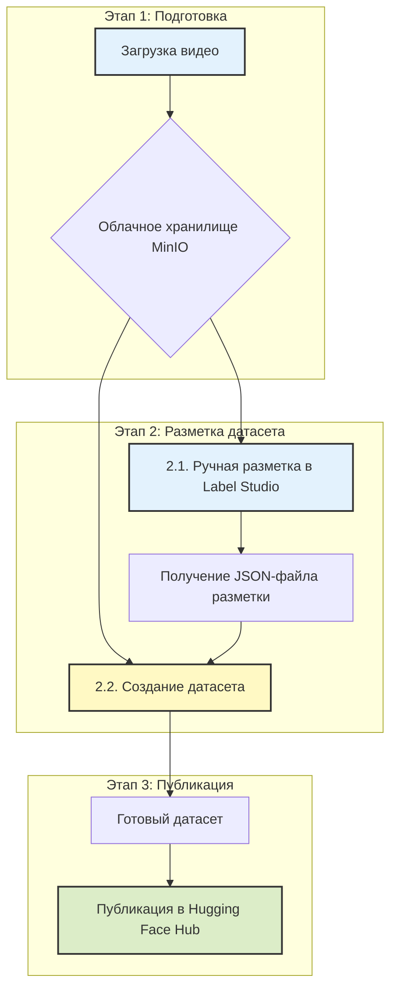

# **PPI Video Processing Platform**

**Pedagogical Pattern Infrastructure (PPI)** — это комплексная веб-платформа, предназначенная для анализа видеозаписей учебных процессов. Она позволяет исследователям и разработчикам проходить полный цикл от сырого видео до готового, структурированного датасета для обучения моделей машинного обучения.

**Цель проекта** — автоматизировать и упростить процесс выявления, разметки и анализа педагогических паттернов.

---

### **Общая схема работы**

Весь процесс построен на последовательном выполнении трех логических этапов, которые проводят пользователя от исходного видео до опубликованного датасета.



---

## **🚀 Рабочий процесс: от видео до датасета**

### **Этап 1. Загрузка видео в облачное хранилище**

**Цель:** Безопасно загрузить исходное видео в централизованное хранилище и подготовить его к разметке.

**Как это работает:**
1.  **Аутентификация.** Пользователь входит в систему под своей учетной записью (`admin` или `DL-user`).
2.  **Загрузка видео.** Через веб-интерфейс пользователь загружает видеофайл урока. Система автоматически извлекает из него аудиодорожку.
3.  **Хранение.** Видео и аудио сохраняются в облачное хранилище MinIO [настройка хранилища](admin_minio.md) в изолированную папку, привязанную к пользователю или задаче.

**Результат этапа.** Видеофайл и его аудиодорожка находятся в облаке и готовы для следующего шага.

---

### **Этап 2. Разметка и формирование датасета**

**Цель.** Сначала вручную разметить видео, выделив педагогические паттерны, а затем на основе этой разметки автоматически сгенерировать структурированный мультимодальный датасет.

#### **2.1. Разметка видео в Label Studio**

**Процесс:**
*   Система предоставляет временную защищенную ссылку (presigned URL) на загруженное видео.
*   Пользователь импортирует видео по этой ссылке в **Label Studio** и, следуя **[руководству по разметке](labelling_lstudio.md)**, аннотирует временные интервалы, соответствующие различным педагогическим паттернам.
*   Результат разметки выгружается в виде **JSON-файла**.

**Результат подэтапа.** JSON-файл с точными временными метками для каждого обнаруженного паттерна.

#### **2.2. Формирование датасета (Benchmark Creating)**

**Процесс:**
*   Это автоматизированный шаг, который выполняется с помощью отдельной программы (Jupyter Notebook).
*   Программа принимает на вход **исходное видео**, полученный **JSON-файл разметки** и **файл с описанием паттернов**.
*   Для каждой аннотации в JSON-файле скрипт автоматически создает "атомарную" единицу датасета, включающую:
    1.  **Видеофрагмент**, точно соответствующий времени паттерна.
    2.  **Ключевой кадр** (фото), отражающий мимику или жест.
    3.  **Транскрипцию речи** только из этого фрагмента.
    4.  **Словарь всех паттернов**, выявленных в данном отрезке.

> **Подробное описание этого процесса, а также ссылка на исполняемый ноутбук находятся в документе: [benchmarks_creating.md](benchmarks_creating.md)**

**Результат этапа.** Готовый к публикации датасет, состоящий из папок с изображениями, видеоклипами, текстами и `metadata.jsonl` файла, который все это связывает.

---

### **Этап 3. Публикация датасета в Hugging Face**

**Цель.** Сделать готовый датасет доступным для всего мира или для исследовательской группы, опубликовав его на платформе Hugging Face.

**Как это работает:**
1.  **Подготовка к публикации.** Создается карточка датасета (README) с описанием его структуры, примеров использования и назначения.
2.  **Загрузка в Hub.** Вся структура папок, полученная на Этапе 2, загружается в новый репозиторий на Hugging Face Hub.
3.  **Публикация.** Датасет становится доступен по ссылке и может быть легко интегрирован в ML-пайплайны.

**Пример готового датасета:**
*   [timbossm/ppi-mgpu-v01_25](https://huggingface.co/datasets/timbossm/ppi-mgpu-v01_25)

---

## **🛠️ Техническая документация для разработчиков**

<details>
<summary><b>🏗️ Архитектура системы, структура проекта, установка и авторизация...</b></summary>

_(Здесь остается вся ваша подробная техническая информация: архитектура, структура проекта, установка, авторизация и т.д.)_

</details>

---

## **👥 Материалы и ссылки**

-   **GitHub:** [Описание проекта](https://bosenkotm.github.io/ppi_mgpu/)
-   **Hugging Face:** [Пример датасета](https://huggingface.co/datasets/timbossm/ppi-mgpu-v01_25)
-   **Документация по процессам:**
    -   [Установка и настройка хранилища MinIO](installing_minio.md)
    -   [Руководство по разметке в Label Studio](labelling_lstudio.md)
    -   [Процесс формирования датасета (Benchmark)](benchmarks_creating.md)

---

### **2. Новый файл `benchmarks_creating.md`**

Создайте в корне вашего проекта новый файл с именем `benchmarks_creating.md` и вставьте в него следующее содержимое:

# **Процесс формирования датасета (Benchmark Creating)**

## **🎯 Цель**

Основная цель этого этапа — преобразовать сырые, размеченные в Label Studio видеоматериалы в структурированный, мультимодальный датасет, готовый для загрузки в Hugging Face и последующего использования в задачах машинного обучения.

## **⚙️ Технология**

Весь процесс реализован в виде интерактивного ноутбука, который можно запустить в облачной среде Google Colab. Это позволяет использовать вычислительные мощности Google (включая GPU для ускорения транскрипции) и не требует установки сложного ПО на локальный компьютер.

> ### **➡️ [Открыть ноутбук для формирования датасета: ppi_dataset_formation.ipynb](ppi_dataset_formation.ipynb)**

*(Примечание: Убедитесь, что файл `ppi_dataset_formation.ipynb` находится в вашем репозитории, чтобы ссылка работала)*

---

## **📥 Входные данные**

Для работы ноутбука требуются три компонента, которые должны быть предварительно загружены на ваш Google Drive:

1.  **Видеофайл (например, `03.mp4`).** Оригинальная видеозапись учебного урока.
2.  **Файл разметки (например, `03.json`).** Результат аннотации из Label Studio.
3.  **Описание паттернов (`patterns.xlsx`).** Таблица с названиями и детальными описаниями паттернов.

---

## **📤 Выходные данные**

На выходе ноутбук генерирует готовую структуру датасета:

```
ppi_final_dataset/
├── images/              # Папка с извлеченными кадрами (JPG)
├── videos/              # Папка с нарезанными видеофрагментами (MP4)
├── texts/               # Папка с транскрипциями для каждого фрагмента (TXT)
└── metadata.jsonl       # Главный файл, связывающий все данные
```

Каждая строка в `metadata.jsonl` описывает один временной фрагмент и содержит **список всех паттернов**, которые были в нем размечены:

```json
{
  "id": "pattern_42",
  "source_video": "03.mp4",
  "start_time": 141.22,
  "end_time": 143.55,
  "patterns": [
    {
      "type": "💖 П: Эмоциональная поддержка",
      "description": "Выражение вербального и невербального одобрения..."
    },
    {
      "type": "🎯 П: Включение в процесс",
      "description": "Активные действия учителя по вовлечению учеников..."
    }
  ],
  "image_path": "images/pattern_42.jpg",
  "video_path": "videos/pattern_42.mp4",
  "text_path": "texts/pattern_42.txt"
}
```

---

## **🔄 Алгоритм работы ноутбука**

1.  **Настройка окружения.** Установка всех необходимых библиотек (`moviepy`, `opencv`, `whisper` и др.).
2.  **Загрузка данных.** Монтирование Google Drive и загрузка исходных файлов.
3.  **Сжатие видео.** Исходный видеофайл сжимается для ускорения дальнейшей обработки.
4.  **Парсинг разметки.** JSON-файл анализируется для извлечения временных меток и названий паттернов.
5.  **Основной цикл обработки.** Для каждой аннотации выполняются следующие действия:
    *   **Нарезка видеофрагмента** с помощью `moviepy`.
    *   **Извлечение ключевого кадра** из середины фрагмента с помощью `OpenCV`.
    *   **Транскрибация аудио** из этого фрагмента с помощью `OpenAI Whisper`.
    *   **Сохранение** всех полученных артефактов (видео, фото, текст) в соответствующие папки.
6.  **Формирование метаданных.** Вся информация собирается и записывается в файл `metadata.jsonl`.
7.  **Валидация и просмотр.** Ноутбук предоставляет интерактивные ячейки для визуальной проверки нескольких случайных примеров из созданного датасета.

