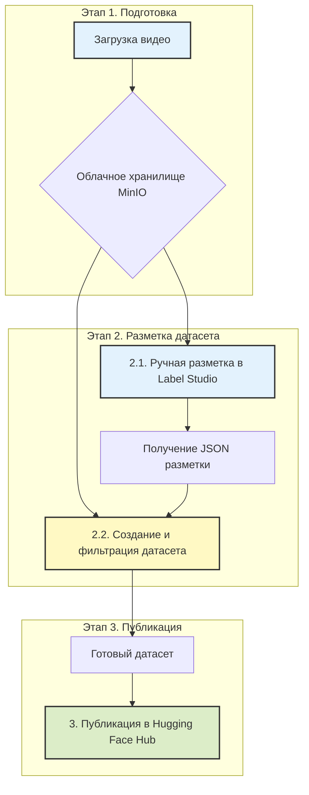
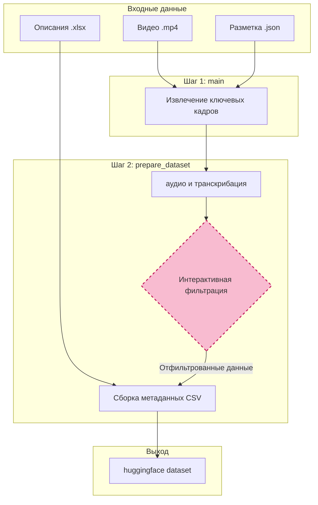
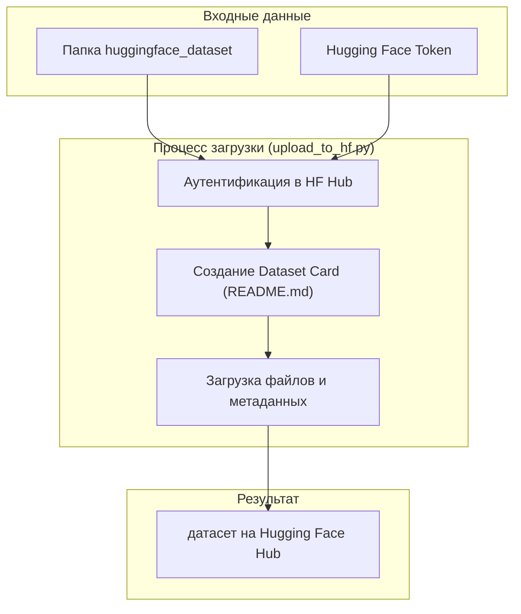

# **PPI Video Processing Platform**

**Pedagogical Pattern Infrastructure (PPI)** — это комплексная веб-платформа, предназначенная для анализа видеозаписей учебных процессов. Она позволяет исследователям и разработчикам проходить полный цикл от сырого видео до готового, структурированного датасета для обучения моделей машинного обучения.

**Цель проекта** — автоматизировать и упростить процесс выявления, разметки и анализа педагогических паттернов.

📖 **[Подробная техническая документация (ppi.md)](ppi.md)**

---

### **Общая схема работы**

Весь процесс построен на последовательном выполнении трех логических этапов, которые проводят пользователя от исходного видео до опубликованного датасета.

---

## **🚀 Рабочий процесс: от видео до датасета**

### **Этап 1. Загрузка видео в облачное хранилище**

**Цель:** Безопасно загрузить исходное видео в централизованное хранилище и подготовить его к разметке.

**Как это работает:**
1.  **Аутентификация.** Пользователь входит в систему под своей учетной записью (`admin` или `DL-user`).
2.  **Загрузка видео.** Через веб-интерфейс пользователь загружает видеофайл урока. Система автоматически извлекает из него аудиодорожку.
3.  **Хранение.** Видео и аудио сохраняются в облачное хранилище MinIO [настройка хранилища](docs/admin_minio.md) в изолированную папку, привязанную к пользователю или задаче.

**Результат этапа.** Видеофайл и его аудиодорожка находятся в облаке и готовы для следующего шага.

---

### **Этап 2. Разметка и формирование датасета**

**Цель.** Сначала вручную разметить видео, выделив педагогические паттерны, а затем на основе этой разметки автоматически сгенерировать структурированный, отфильтрованный и обогащенный мультимодальный датасет.

#### **2.1. Разметка видео в Label Studio**

  

[Website](https://labelstud.io/) • [Docs](https://labelstud.io/guide/) • [Join Slack Community ](https://slack.labelstud.io/?source=github-1)

**Процесс:**
*   Система предоставляет временную защищенную ссылку (presigned URL) на загруженное видео.
*   Пользователь импортирует видео по этой ссылке в **Label Studio** и, следуя **[руководству по разметке](docs/labelling_lstudio.md)**, аннотирует временные интервалы, соответствующие различным педагогическим паттернам.
*   Результат разметки выгружается в виде **JSON-файла**.

**Результат подэтапа.** JSON-файл с точными временными метками для каждого обнаруженного паттерна.

#### **2.2. Формирование и фильтрация датасета**

**Процесс:**
*   Это автоматизированный шаг, который выполняется с помощью набора Python-скриптов.
*   Скрипты принимают на вход **исходное видео**, полученный **JSON-файл разметки** и **Excel-файл с описанием паттернов**.
*   Процесс состоит из двух ключевых фаз:
    1.  **Извлечение артефактов:** Для каждой аннотации в JSON-файле скрипт автоматически вырезает видеофрагмент и извлекает из его середины ключевой кадр (фото).
    2.  **Сборка и обогащение:** Скрипт извлекает аудиодорожку из каждого видеофрагмента, транскрибирует речь с помощью Whisper, а затем связывает все медиафайлы с описаниями из Excel.
    3.  **Интерактивная фильтрация:** Перед финальной сборкой система предлагает пользователю просмотреть список всех извлеченных кадров и ввести номера тех, которые нужно исключить (например, если в кадр не попал преподаватель). Это гарантирует высокое качество итогового датасета.

**Архитектура обработки:**

**Результат этапа.** Готовая к публикации папка, содержащая подпапки с отфильтрованными изображениями, видеоклипами, аудиофайлами, текстами и главным `metadata.csv` файлом, который все это связывает.

---

### **Этап 3. Публикация датасета в Hugging Face**

**Цель.** Сделать готовый, качественный датасет доступным для всего мира или для исследовательской группы, опубликовав его на платформе Hugging Face.

**Как это работает:**
1.  **Аутентификация.** Запускается скрипт, который запрашивает токен доступа к Hugging Face.
2.  **Подготовка к публикации.** Автоматически создается карточка датасета (README) с описанием его структуры, примеров использования и назначения.
3.  **Загрузка в Hub.** Вся структура папок, полученная на Этапе 2, загружается в новый репозиторий на Hugging Face Hub.
4.  **Публикация.** Датасет становится доступен по ссылке и может быть легко интегрирован в ML-пайплайны.

**Архитектура загрузки:**

**Пример готового датасета:**
*   [expertAB](https://huggingface.co/datasets/icomgpu/expertAB)

---

## **👥 Материалы и ссылки**

-   **GitHub:** [Описание проекта](https://bosenkotm.github.io/ppi_mgpu/)
-   **Hugging Face:** [Пример датасета](https://huggingface.co/datasets/icomgpu/expertAB)
-   **Документация по процессам:**
    -   [Установка и настройка хранилища MinIO](docs/admin_minio.md)
    -   [Руководство по разметке в Label Studio](docs/labelling_lstudio.md)
    -   [Процесс формирования датасета (Benchmark)](docs/benchmarks_creating.md)
    -   [Техническая документация PPI](ppi.md)
