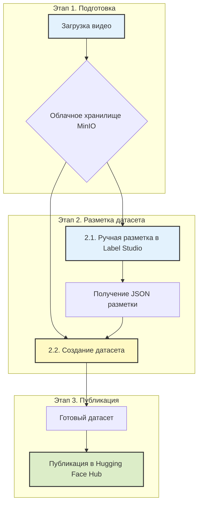

# **PPI Video Processing Platform**

**Pedagogical Pattern Infrastructure (PPI)** — это комплексная веб-платформа, предназначенная для анализа видеозаписей учебных процессов. Она позволяет исследователям и разработчикам проходить полный цикл от сырого видео до готового, структурированного датасета для обучения моделей машинного обучения.

**Цель проекта** — автоматизировать и упростить процесс выявления, разметки и анализа педагогических паттернов.

---

### **Общая схема работы**

Весь процесс построен на последовательном выполнении трех логических этапов, которые проводят пользователя от исходного видео до опубликованного датасета.



---

## **🚀 Рабочий процесс: от видео до датасета**

### **Этап 1. Загрузка видео в облачное хранилище**

**Цель:** Безопасно загрузить исходное видео в централизованное хранилище и подготовить его к разметке.

**Как это работает:**
1.  **Аутентификация.** Пользователь входит в систему под своей учетной записью (`admin` или `DL-user`).
2.  **Загрузка видео.** Через веб-интерфейс пользователь загружает видеофайл урока. Система автоматически извлекает из него аудиодорожку.
3.  **Хранение.** Видео и аудио сохраняются в облачное хранилище MinIO [настройка хранилища](docs/admin_minio.md) в изолированную папку, привязанную к пользователю или задаче.

**Результат этапа.** Видеофайл и его аудиодорожка находятся в облаке и готовы для следующего шага.

---

### **Этап 2. Разметка и формирование датасета**

**Цель.** Сначала вручную разметить видео, выделив педагогические паттерны, а затем на основе этой разметки автоматически сгенерировать структурированный мультимодальный датасет.

#### **2.1. Разметка видео в Label Studio**

**Процесс:**
*   Система предоставляет временную защищенную ссылку (presigned URL) на загруженное видео.
*   Пользователь импортирует видео по этой ссылке в **Label Studio** и, следуя **[руководству по разметке](docs/labelling_lstudio.md)**, аннотирует временные интервалы, соответствующие различным педагогическим паттернам.
*   Результат разметки выгружается в виде **JSON-файла**.

**Результат подэтапа.** JSON-файл с точными временными метками для каждого обнаруженного паттерна.

#### **2.2. Формирование датасета (Benchmark Creating)**

**Процесс:**
*   Это автоматизированный шаг, который выполняется с помощью отдельной программы (Jupyter Notebook).
*   Программа принимает на вход **исходное видео**, полученный **JSON-файл разметки** и **файл с описанием паттернов**.
*   Для каждой аннотации в JSON-файле скрипт автоматически создает "атомарную" единицу датасета, включающую:
    1.  **Видеофрагмент**, точно соответствующий времени паттерна.
    2.  **Ключевой кадр** (фото), отражающий мимику или жест.
    3.  **Транскрипцию речи** только из этого фрагмента.
    4.  **Словарь всех паттернов**, выявленных в данном отрезке.

> **Подробное описание этого процесса, а также ссылка на исполняемый ноутбук находятся в документе: [benchmarks_creating.md](docs/benchmarks_creating.md)**

**Результат этапа.** Готовый к публикации датасет, состоящий из папок с изображениями, видеоклипами, текстами и `metadata.jsonl` файла, который все это связывает.

---

### **Этап 3. Публикация датасета в Hugging Face**

**Цель.** Сделать готовый датасет доступным для всего мира или для исследовательской группы, опубликовав его на платформе Hugging Face.

**Как это работает:**
1.  **Подготовка к публикации.** Создается карточка датасета (README) с описанием его структуры, примеров использования и назначения.
2.  **Загрузка в Hub.** Вся структура папок, полученная на Этапе 2, загружается в новый репозиторий на Hugging Face Hub.
3.  **Публикация.** Датасет становится доступен по ссылке и может быть легко интегрирован в ML-пайплайны.

**Пример готового датасета:**
*   [timbossm/ppi-mgpu-v01_25](https://huggingface.co/datasets/timbossm/ppi-mgpu-v01_25)

---

## **🛠️ Техническая документация для разработчиков**

<details>
<summary><b>🏗️ Архитектура системы, структура проекта, установка и авторизация...</b></summary>

### Общая схема работы:

```
Этап 1. Загрузка и разметка
┌─────────────┐     ┌─────────────┐     ┌─────────────┐
│   Видео     │ --> │   MinIO     │ --> │Label Studio │
│  Загрузка   │     │  (raw-data) │     │  Разметка   │
└─────────────┘     └─────────────┘     └─────────────┘
                                              │
                                              v
                                    ┌─────────────┐
                                    │  JSON файл  │
                                    │  (patterns) │
                                    └─────────────┘

Этап 2. Обработка (в разработке)
┌─────────────┐     ┌─────────────┐     ┌─────────────┐
│   Видео     │ +   │  JSON       │ --> │ Обработка   │
│  (raw-data) │     │  (patterns) │     │  видео      │
└─────────────┘     └─────────────┘     └─────────────┘
                                              │
                                              v
                                    ┌─────────────┐
                                    │  Датасет    │
                                    │(final-data) │
                                    └─────────────┘

Этап 3. Публикация
┌─────────────┐     ┌─────────────┐     ┌─────────────┐
│  Датасет    │ --> │  Описание   │ --> │Hugging Face │
│(final-data) │     │  датасета   │     │    Hub      │
└─────────────┘     └─────────────┘     └─────────────┘
```

---

## 🏗️ Архитектура системы

```
┌─────────────────────────────────────────────────────────────────┐
│                         КЛИЕНТ (Браузер)                        │
│  ┌──────────────────────────────────────────────────────────┐   │
│  │  HTML/CSS/JavaScript                                     │   │
│  │  - Модальное окно аутентификации                         │   │
│  │  - Пошаговый интерфейс (3 шага)                          │   │
│  │  - Загрузка файлов (локально или из MinIO)               │   │
│  │  - Отображение прогресса в реальном времени              │   │
│  │  - Модальное окно с presigned URL для Label Studio       │   │
│  │  - Управление файлами в облаке                           │   │
│  └──────────────────────────────────────────────────────────┘   │
└────────────────────────────┬────────────────────────────────────┘
                             │ HTTP/HTTPS
                             │ REST API
┌────────────────────────────▼────────────────────────────────────┐
│                    FLASK BACKEND (app.py)                       │
│  ┌──────────────────────────────────────────────────────────┐   │
│  │  Маршруты и обработка запросов                           │   │
│  │  - /api/login (аутентификация)                           │   │
│  │  - /api/process-video (защищен, асинхронная обработка)   │   │
│  │  - /api/status/<file_id> (статус обработки)              │   │
│  │  - /api/transcribe (транскрибация)                       │   │
│  │  - /list_files (фильтрация по роли)                      │   │
│  │  - /delete_file (контроль доступа)                       │   │
│  └──────────────────────────────────────────────────────────┘   │
│                                                                 │
│  ┌───────────────────┐  ┌──────────────────┐  ┌──────────────┐  │
│  │  video_processor  │  │  minio_handler   │  │    config    │  │
│  │  - extract_audio  │  │  - upload_file   │  │  - settings  │  │
│  │  - transcribe     │  │  - download      │  │  - logging   │  │
│  │  - prepare_data   │  │  - list/delete   │  │              │  │
│  │                   │  │  - presigned_url │  │              │  │
│  │                   │  │  - get_file_owner│  │              │  │
│  └───────────────────┘  └──────────────────┘  └──────────────┘  │
└────────────┬──────────────────┬──────────────────┬──────────────┘
             │                  │                  │
             │                  │                  │
    ┌────────▼─────────┐ ┌──────▼──────┐ ┌────────▼────────┐
    │   FFmpeg         │ │   MinIO     │ │   Redis         │
    │   (Audio Extract)│ │  (Storage)  │ │  (Cache/Status) │
    │                  │ │  + Metadata │ │                 │
    └──────────────────┘ └─────────────┘ └─────────────────┘
             │
    ┌────────▼────────┐
    │  OpenAI Whisper │
    │  (Transcription)│
    └─────────────────┘
```

### Компоненты системы:

1. **Frontend (Клиент)**
   - Статический HTML/CSS/JavaScript
   - Модальное окно аутентификации
   - Пошаговый интерфейс рабочего процесса (3 шага)
   - Отправка файлов через FormData
   - Polling статуса через `/api/status/<file_id>`
   - Модальное окно с presigned URL для Label Studio

2. **Backend (Flask)**
   - Flask-Login для аутентификации
   - Асинхронная обработка в отдельных потоках
   - Хранение статуса в памяти и Redis
   - Ролевой контроль доступа (admin, DL-user)
   - Отслеживание владельцев файлов через метаданные MinIO
   - Генерация presigned URLs для Label Studio

3. **Обработка видео (video_processor.py)**
   - Извлечение аудио через FFmpeg
   - Транскрибация через Whisper
   - Подготовка данных для Label Studio

4. **Хранилище (minio_handler.py)**
   - Загрузка/скачивание файлов
   - Управление объектами в бакетах
   - Сохранение метаданных (user_id)
   - Получение владельца файла
   - Фильтрация по ролям
   - Генерация presigned URLs

5. **Кэш (Redis, опционально)**
   - Хранение статусов обработки
   - Персистентность между перезапусками

---

## 🛠️ Технологический стек

### Backend:
- **Python 3.10+** — основной язык программирования
- **Flask 2.3.3** — веб-фреймворк
- **Flask-Login 0.6.3+** — аутентификация и управление сессиями
- **Werkzeug 2.3.7** — утилиты для работы с запросами
- **MinIO 7.2.18+** — клиент для работы с объектным хранилищем (S3-совместимое)
- **OpenAI Whisper** — модель для транскрибации аудио
- **Redis 5.0.0+** (опционально) — кэширование и хранение статусов

### Инфраструктура:
- **FFmpeg** — извлечение аудио из видео
- **MinIO Server** — объектное хранилище (S3-совместимое)
- **Label Studio** — инструмент для разметки данных

### Frontend:
- **HTML5** — структура страницы
- **CSS3** — стилизация (градиенты, анимации, пошаговый интерфейс)
- **Vanilla JavaScript** — логика интерфейса (без фреймворков)

### Обработка данных:
- **PyTorch** (CPU-only) — движок для Whisper
- **librosa** (опционально) — оценка длительности аудио

---

## 📦 Модули системы

### 1. `app.py` — Главный модуль Flask-приложения

**Ответственность:**
- Инициализация Flask-приложения и Flask-Login
- Определение всех REST API маршрутов
- Аутентификация и авторизация пользователей
- Управление сессиями и ролевой контроль доступа
- Координация обработки видео (асинхронная обработка в потоках)
- Управление статусами обработки (в памяти и Redis)
- Генерация presigned URLs для Label Studio

**Ключевые функции:**
- `api_process_video()` — обработка загруженного видео (локально или из MinIO)
- `api_transcribe()` — запуск транскрибации аудио
- `get_status()` — получение статуса обработки файла
- `process_uploaded_video()` — обработка локально загруженного файла
- `process_storage_object()` — обработка файла из MinIO
- `build_task_folder()` — создание структуры папок для файлов
- `update_status()` — обновление статуса обработки

**Особенности:**
- Асинхронная обработка в отдельных потоках (threading)
- Хранение статусов в памяти (`_status_data`) и Redis
- Ролевой контроль доступа (admin может все, DL-user только свои файлы)
- Ограничение загрузки для DL-user (максимум 1 файл)

---

### 2. `minio_handler.py` — Модуль работы с MinIO

**Ответственность:**
- Управление подключением к MinIO серверу
- Загрузка файлов в MinIO с метаданными (user_id)
- Скачивание файлов из MinIO
- Получение списка файлов с фильтрацией по владельцу
- Удаление файлов из MinIO
- Генерация presigned URLs для временного доступа к файлам
- Получение метаданных файлов (владелец)

**Ключевые функции:**
- `get_minio_client()` — создание клиента MinIO
- `upload_file()` — загрузка файла с сохранением user_id в метаданных
- `download_object()` — скачивание объекта из MinIO
- `list_bucket_objects()` — получение списка файлов с фильтрацией по user_id
- `delete_object()` — удаление файла из MinIO
- `generate_presigned_url()` — генерация временной ссылки для Label Studio (7 дней)
- `get_file_owner()` — получение user_id из метаданных файла

**Особенности:**
- Сохранение `user_id` в метаданных файла (`X-Amz-Meta-User-Id`)
- Замена внутреннего адреса MinIO на публичный URL в presigned URLs
- Фильтрация файлов по владельцу для DL-user
- Проверка доступа к бакетам перед операциями

---

### 3. `video_processor.py` — Модуль обработки видео и аудио

**Ответственность:**
- Извлечение аудиодорожки из видеофайлов
- Транскрибация аудио с помощью OpenAI Whisper
- Подготовка данных для Label Studio
- Синхронизация данных с директорией Label Studio

**Ключевые функции:**
- `extract_audio()` — извлечение аудио из видео через FFmpeg (WAV, 44.1kHz, стерео, PCM 16-bit)
- `transcribe_audio()` — транскрибация аудио с помощью Whisper (с поддержкой прогресса)
- `run_data_preparation()` — запуск скрипта подготовки данных и синхронизация с Label Studio

**Особенности:**
- Поддержка различных размеров моделей Whisper (tiny, base, small, medium, large)
- Callback для отслеживания прогресса транскрибации
- Автоматическое определение языка или указание вручную
- Синхронизация подготовленных данных с директорией Label Studio

---

### 4. `config.py` — Модуль конфигурации

**Ответственность:**
- Хранение всех настроек приложения
- Управление путями к директориям
- Конфигурация подключения к MinIO
- Конфигурация подключения к Redis
- Настройки обработки (FFmpeg, Whisper)
- Настройка логирования

**Ключевые параметры:**
- `MINIO_ENDPOINT` — адрес MinIO сервера
- `MINIO_ACCESS_KEY` / `MINIO_SECRET_KEY` — учетные данные MinIO
- `MINIO_PUBLIC_URL` — публичный URL для presigned URLs
- `RAW_DATA_BUCKET` — бакет для исходных данных
- `FINAL_DATASET_BUCKET` — бакет для готовых датасетов
- `REDIS_ENABLED` — включение/выключение Redis
- `WHISPER_MODEL_SIZE` — размер модели Whisper
- `FFMPEG_BINARY` — путь к FFmpeg

**Особенности:**
- Все параметры можно переопределить через переменные окружения
- Автоматическое создание необходимых директорий
- Настройка логирования (файл и консоль)

---

### 5. Frontend модули

#### `templates/index.html` — Главная страница

**Ответственность:**
- Структура пошагового интерфейса (3 шага)
- Модальные окна (аутентификация, Label Studio URL, список файлов)
- Интеграция с Flask-Login (передача `current_user` в шаблон)
- Отображение информации о пользователе

**Структура:**
- Шаг 1: Загрузка видео (локально или из MinIO)
- Шаг 2: Формирование датасета (Pattern Benchmark)
- Шаг 3: Анализ и экспорт в Hugging Face

#### `static/css/style.css` — Стили интерфейса

**Ответственность:**
- Стилизация пошагового интерфейса
- Анимации переходов между шагами
- Стили модальных окон
- Стили для заблокированного контента (до аутентификации)
- Стили для мини-окна с presigned URL

#### `static/js/script.js` — JavaScript логика

**Ответственность:**
- Обработка аутентификации
- Управление пошаговым интерфейсом
- Загрузка файлов (локально или из MinIO)
- Polling статуса обработки
- Отображение модального окна с presigned URL
- Копирование URL в буфер обмена
- Управление мини-окном с URL
- Навигация между шагами

**Ключевые функции:**
- `goToStep(stepNumber)` — переход между шагами
- `startStatusPolling(fileId)` — опрос статуса обработки
- `showLabelStudioModal(url)` — отображение модального окна с URL
- `collapseToMini()` — сворачивание модального окна в мини-окно

---

## 🔄 Алгоритм загрузки данных и работы в Label Studio

### Этап 1. Загрузка и обработка видео

1. **Аутентификация пользователя**
   - Пользователь открывает приложение
   - Интерфейс заблокирован до входа
   - Пользователь входит через модальное окно
   - Интерфейс разблокируется

2. **Выбор источника видео**
   - **Вариант A:** Загрузка с компьютера
     - Пользователь нажимает "Select from Computer"
     - Выбирает видеофайл (MP4, AVI, MOV, MKV)
     - Вводит название задачи в модальном окне
     - Нажимает "Process Local Video"
   
   - **Вариант B:** Выбор из MinIO хранилища
     - Пользователь нажимает "Select from Storage"
     - Открывается модальное окно со списком файлов (отфильтровано по роли)
     - Выбирает файл из списка
     - Вводит название задачи
     - Нажимает "Process Storage Selection"

3. **Обработка видео (асинхронно)**
   - Файл сохраняется во временную директорию
   - Создается уникальный `file_id` для отслеживания
   - Запускается отдельный поток для обработки
   - Статус обновляется: `uploading_video` → `extracting_audio` → `completed`

4. **Загрузка в MinIO**
   - Видео загружается в MinIO в папку:
     - Для **admin**: `task_name_YYYYMMDD/video.mp4`
     - Для **DL-user**: `username/task_name_YYYYMMDD/video.mp4`
   - В метаданные файла сохраняется `user_id
   - Извлекается аудиодорожка через FFmpeg
   - Аудио загружается в ту же папку: `task_name_YYYYMMDD/video.wav`

5. **Генерация presigned URL**
   - После успешной загрузки генерируется presigned URL
   - URL действителен 7 дней
   - Внутренний адрес MinIO заменяется на публичный URL (`MINIO_PUBLIC_URL`)
   - URL сохраняется в `record.shareable_url`

6. **Отображение результата**
   - Статус меняется на `completed`
   - Появляется сообщение "✅ Data uploaded to cloud storage"
   - Появляется кнопка "🎤 Transcribe Audio"
   - **Автоматически открывается модальное окно с presigned URL**

### Этап 2. Модальное окно с presigned URL

1. **Автоматическое отображение модального окна**
   - Когда статус становится `completed` и `shareable_url` доступен
   - Модальное окно содержит:
     - Заголовок: "Video Ready for Label Studio"
     - Пояснительный текст
     - Поле с presigned URL (readonly)
     - Кнопка "Copy Link"
     - Кнопка "Close"

2. **Копирование URL**
   - Пользователь нажимает "Copy Link"
   - URL копируется в буфер обмена через Clipboard API
   - Кнопка меняет текст на "Copied!" на 2 секунды
   - Модальное окно сворачивается в мини-окно в правом нижнем углу

3. **Мини-окно**
   - Отображается в правом нижнем углу браузера
   - Показывает "✅ Link Copied!"
   - Кнопка "Show Link" для повторного отображения модального окна
   - Кнопка закрытия (×)

### Этап 3. Работа в Label Studio

1. **Импорт файла в Label Studio**
   - Пользователь открывает Label Studio (http://95.131.149.21:8500/)
   - Создает новый проект или открывает существующий
   - Переходит в раздел "Import"
   - Выбирает "Import from URL"
   - Вставляет скопированный presigned URL
   - Нажимает "Import"

2. **Разметка данных**
   - Видео загружается в Label Studio
   - Пользователь выполняет разметку (аннотацию)
   - Результаты разметки сохраняются в Label Studio

3. **Экспорт данных (опционально)**
   - После разметки данные можно экспортировать
   - Экспорт в различные форматы (JSON, CSV и т.д.)
   - Данные готовы для использования в ML моделях

### Этап 4. Транскрибация (опционально)

1. **Запуск транскрибации**
   - Пользователь нажимает кнопку "🎤 Transcribe Audio"
   - Отправляется запрос на `/api/transcribe` с `file_id`
   - Запускается отдельный поток для транскрибации

2. **Процесс транскрибации**
   - Статус обновляется: `transcribing` с прогрессом (0-100%)
   - Загружается модель Whisper (размер из `WHISPER_MODEL_SIZE`)
   - Выполняется транскрибация аудио
   - Результат сохраняется в текстовый файл

3. **Сохранение результата**
   - Транскрипция загружается в MinIO в ту же папку: `task_name_YYYYMMDD/video.txt`
   - Статус меняется на `completed`
   - Транскрипция доступна для дальнейшей обработки

### Структура данных в MinIO:

```
raw-data/
├── admin_1/
│   └── Interview_20241107/
│       ├── video.mp4          # Исходное видео
│       ├── video.wav          # Извлеченное аудио
│       └── video.txt          # Транскрипция (если выполнена)
├── dl_user_01/
│   └── lesson_20241107/
│       ├── lesson.mp4
│       ├── lesson.wav
│       └── lesson.txt
└── ...
```

### Особенности:

- **Асинхронная обработка**: Все операции выполняются в отдельных потоках
- **Параллельная работа**: Можно загружать новые файлы во время транскрибации предыдущих
- **Presigned URLs**: Временные ссылки (7 дней) для безопасного доступа к файлам
- **Ролевой контроль**: DL-user видят только свои файлы, admin видит все
- **Ограничения для DL-user**: Максимум 1 загруженный файл

---

## 📁 Структура проекта

```
landing/
├── app.py                 # Главный файл Flask приложения
├── config.py              # Конфигурация и настройки
├── minio_handler.py       # Работа с MinIO хранилищем
├── video_processor.py     # Обработка видео и транскрибация
├── requirements.txt        # Зависимости Python
├── users.json             # Учетные данные пользователей (admin, DL-user)
├── users.md               # Документация пользователей
├── README.md              # Документация (этот файл)
│
├── templates/
│   ├── index.html         # Главная страница веб-интерфейса
│   └── ppi_landing.html   # Статическая страница PPI Dashboard
│
├── static/
│   ├── css/
│   │   └── style.css      # Стили интерфейса
│   └── js/
│       └── script.js      # JavaScript логика
│
├── logo/                  # Логотипы и изображения
│   ├── mgpu-en-itso.png
│   ├── GitHub-logo-500x289.jpg
│   ├── images.png
│   └── favicon/           # Файлы favicon
│
├── uploads/               # Временные загруженные файлы
└── prepared_files/         # Обработанные файлы (временные, перед загрузкой в MinIO)
```

---

## 🚀 Установка и настройка

### Требования:

- Python 3.10 или выше
- FFmpeg установлен и доступен в PATH
- MinIO сервер запущен и доступен
- Redis (опционально, для кэширования)

### Установка зависимостей:

```bash
# Перейти в каталог проекта
cd /home/llm/landing

# (Опционально) Создать виртуальное окружение
python3 -m venv .venv
source .venv/bin/activate

# Установить зависимости
pip install -r requirements.txt

# Установить CPU-only версию PyTorch (для Whisper)
pip install torch torchvision torchaudio --index-url https://download.pytorch.org/whl/cpu
```

### Настройка FFmpeg:

```bash
# Проверить установку
which ffmpeg

# Если не установлен (Ubuntu/Debian):
sudo apt install ffmpeg

# Указать путь в config.py или через переменную окружения:
export FFMPEG_BINARY=/usr/bin/ffmpeg
```

---

## ▶️ Запуск приложения

### Режим разработки (Development):

```bash
# Простой запуск
python3 app.py

# Приложение будет доступно на http://0.0.0.0:5000
# Остановка: Ctrl+C
```

### Режим продакшена (Production):

```bash
# Использование Gunicorn (рекомендуется)
pip install gunicorn
gunicorn -w 4 -b 0.0.0.0:5000 app:app

# Или с использованием systemd (создать сервис)
# См. примеры в документации Flask
```

### Переменные окружения:

```bash
# Минимальная конфигурация
export MINIO_ENDPOINT=192.168.0.27:9000
export MINIO_ACCESS_KEY=your_access_key
export MINIO_SECRET_KEY=your_secret_key

# Опционально: настройка Whisper
export WHISPER_MODEL_SIZE=base  # tiny, base, small, medium, large

# Опционально: Redis
export REDIS_ENABLED=true
export REDIS_HOST=localhost
export REDIS_PORT=6379

# Опционально: Секретный ключ для сессий
export SECRET_KEY=your-secret-key-here

# Запуск
python3 app.py
```

---

## 🔐 Аутентификация и авторизация

### Роли пользователей:

1. **Администратор (admin)**
   - Полный доступ ко всем файлам
   - Может удалять любые файлы
   - Без ограничений на загрузку
   - Видит все файлы в хранилище

2. **DL-user**
   - Ограниченный доступ только к своим файлам
   - Может загрузить максимум 1 файл
   - Может удалять только свои файлы
   - Видит только свои файлы в хранилище
   - Файлы организованы в папках `username/task_name_YYYYMMDD`

### Процесс аутентификации:

1. Пользователь открывает приложение
2. Интерфейс заблокирован до аутентификации
3. Пользователь нажимает кнопку "Log In"
4. Появляется модальное окно входа
5. Пользователь вводит логин и пароль
6. При успехе страница перезагружается и интерфейс разблокируется
7. Информация о пользователе отображается в верхней панели

### Контроль доступа:

- **Загрузка файлов**: Все аутентифицированные пользователи могут загружать
- **Список файлов**: DL-user видят только свои файлы, админы видят все
- **Удаление файлов**: DL-user могут удалять только свои файлы, админы могут удалять любые
- **Владение файлами**: Отслеживается через метаданные MinIO (`X-Amz-Meta-User-Id`)

### Учетные данные пользователей:

Учетные данные хранятся в `users.json`. См. `users.md` для полного списка.

**Примеры учетных данных:**
- Администратор: 
- DL-user: dl_user_01` / `ppi_user_pass01`

---

## 🔌 API и методы

### Основные маршруты:

#### `GET /`
Главная страница приложения.

**Ответ:** HTML страница с интерфейсом загрузки.

**Примечание:** Страница доступна всем, но контент заблокирован до аутентификации.

---

#### `POST /api/login`
Аутентификация пользователя.

**Запрос:**
```json
{
  "username": "",
  "password": ""
}
```

**Ответ:**
```json
{
  "success": true,
  "user": {
    "id": "admin_1",
    "username": "admin_1",
    "role": "admin"
  }
}
```

---

#### `GET /logout`
Выход пользователя.

**Требуется:** Аутентификация

**Ответ:** Перенаправление на главную страницу.

---

#### `POST /api/process-video`
Обработка видео (загрузка с компьютера или из хранилища).

**Требуется:** Аутентификация

**Для DL-user:** Применяется ограничение максимум 1 файл.

**Формат запроса 1 (локальный файл):**
```http
POST /api/process-video
Content-Type: multipart/form-data

video: <file>
task_name: "my_task"
parts: 1 (опционально)
```

**Формат запроса 2 (файл из хранилища):**
```json
POST /api/process-video
Content-Type: application/json

{
  "object_name": "username/task_name_20241107/video.mp4",
  "task_name": "my_task",
  "parts": 1
}
```

**Ответ:**
```json
{
  "success": true,
  "file_id": "file_1234567890_abc123..."
}
```

**Процесс обработки:**
1. Загрузка видео в MinIO (`uploading_video`)
2. Извлечение аудио (`extracting_audio`)
3. Сохранение результатов (`completed`)
4. Транскрибация доступна через отдельный эндпоинт

**Структура папок:**
- Администратор: `task_name_YYYYMMDD/`
- DL-user: `username/task_name_YYYYMMDD/`

---

#### `GET /api/status/<file_id>`
Получение статуса обработки файла.

**Ответ:**
```json
{
  "status": "transcribing",
  "progress": 45,
  "message": "Transcribing... 45%",
  "timestamp": 1234567890.123,
  "transcription_ready": true,
  "file_id": "file_123...",
  "shareable_url": "http://192.168.0.27:9000/raw-data/..."
}
```

**Возможные статусы:**
- `uploading_video` — загрузка видео
- `downloading` — скачивание из хранилища
- `extracting_audio` — извлечение аудио
- `transcribing` — транскрибация
- `completed` — обработка завершена
- `error` — ошибка обработки

**Примечание:** Поле `shareable_url` присутствует только когда статус `completed` и файл обработан.

---

#### `POST /api/transcribe`
Запуск транскрибации для обработанного файла.

**Требуется:** Аутентификация

**Запрос:**
```json
{
  "file_id": "file_1234567890_abc123..."
}
```

**Ответ:**
```json
{
  "success": true,
  "transcription_file_id": "transcribe_1234567890_xyz789..."
}
```

---

#### `GET /list_files`
Список файлов в MinIO хранилище.

**Требуется:** Аутентификация

**Ответ:**
```json
{
  "success": true,
  "files": [
    {
      "name": "dl_user_01/task_20241107/video.mp4",
      "size_mb": 125.5,
      "last_modified": "2025-11-07T10:30:00"
    }
  ]
}
```

**Примечание:** DL-user видят только свои файлы. Админы видят все файлы.

---

#### `POST /delete_file`
Удаление файла из MinIO.

**Требуется:** Аутентификация

**Запрос:**
```json
{
  "object_name": "dl_user_01/task_20241107/video.mp4"
}
```

**Ответ:**
```json
{
  "success": true
}
```

**Ответ об ошибке (DL-user пытается удалить чужой файл):**
```json
{
  "success": false,
  "error": "You don't have permission to delete this file. Please contact an administrator."
}
```

---

## ⚙️ Конфигурация

### Переменные окружения:

| Переменная | Описание | Значение по умолчанию |
|------------|----------|----------------------|
| `MINIO_ENDPOINT` | Адрес MinIO сервера | `192.168.0.27:9000` |
| `MINIO_ACCESS_KEY` | Ключ доступа MinIO | `labelstudio-user` |
| `MINIO_SECRET_KEY` | Секретный ключ MinIO | (см. config.py) |
| `MINIO_SECURE` | Использовать HTTPS | `false` |
| `MINIO_PUBLIC_URL` | Публичный URL для presigned URLs | `http://192.168.0.27:9000` |
| `RAW_DATA_BUCKET` | Бакет для исходных данных | `raw-data` |
| `FINAL_DATASET_BUCKET` | Бакет для готовых датасетов | `final-dataset` |
| `LABEL_STUDIO_DATA_DIR` | Путь к данным Label Studio | `/home/llm/label_studio/data` |
| `REDIS_ENABLED` | Включить Redis | `true` |
| `REDIS_HOST` | Хост Redis | `localhost` |
| `REDIS_PORT` | Порт Redis | `6379` |
| `REDIS_DB` | База данных Redis | `0` |
| `FFMPEG_BINARY` | Путь к FFmpeg | `/usr/bin/ffmpeg` |
| `WHISPER_MODEL_SIZE` | Размер модели Whisper | `base` |
| `APP_LOG_FILE` | Путь к лог-файлу | `minio_operations.log` |
| `SECRET_KEY` | Секретный ключ Flask для сессий | (автогенерируется) |

Все переменные можно переопределить в `config.py` или через переменные окружения.

---

## 📄 Лицензия

Проект разработан для анализа педагогических паттернов.


</details>

---

## **👥 Материалы и ссылки**

-   **GitHub:** [Описание проекта](https://bosenkotm.github.io/ppi_mgpu/)
-   **Hugging Face:** [Пример датасета](https://huggingface.co/datasets/timbossm/ppi-mgpu-v01_25)
-   **Документация по процессам:**
    -   [Установка и настройка хранилища MinIO](docs/admin_minio.md)
    -   [Руководство по разметке в Label Studio](docs/labelling_lstudio.md)
    -   [Процесс формирования датасета (Benchmark)](docs/benchmarks_creating.md)

---


