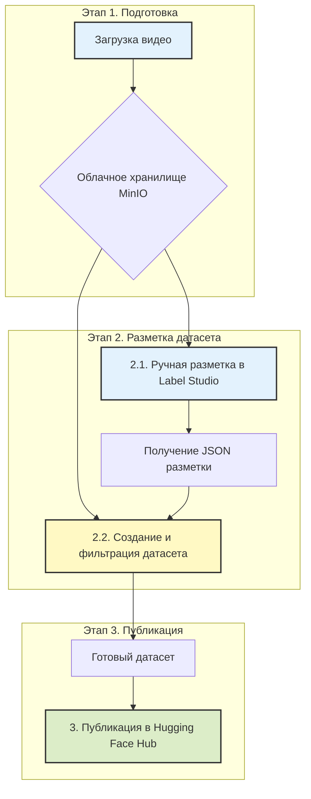

# **PPI Video Processing Platform**

**Pedagogical Pattern Infrastructure (PPI)** — это комплексная веб-платформа, предназначенная для анализа видеозаписей учебных процессов. Она позволяет исследователям и разработчикам проходить полный цикл от сырого видео до готового, структурированного датасета для обучения моделей машинного обучения.

**Цель проекта** — автоматизировать и упростить процесс выявления, разметки и анализа педагогических паттернов.

---

### **Общая схема работы**

Весь процесс построен на последовательном выполнении трех логических этапов, которые проводят пользователя от исходного видео до опубликованного датасета.



---

## **🚀 Рабочий процесс: от видео до датасета**

### **Этап 1. Загрузка видео в облачное хранилище**

**Цель:** Безопасно загрузить исходное видео в централизованное хранилище и подготовить его к разметке.

**Как это работает:**
1.  **Аутентификация.** Пользователь входит в систему под своей учетной записью (`admin` или `DL-user`).
2.  **Загрузка видео.** Через веб-интерфейс пользователь загружает видеофайл урока. Система автоматически извлекает из него аудиодорожку.
3.  **Хранение.** Видео и аудио сохраняются в облачное хранилище MinIO [настройка хранилища](docs/admin_minio.md) в изолированную папку, привязанную к пользователю или задаче.

**Результат этапа.** Видеофайл и его аудиодорожка находятся в облаке и готовы для следующего шага.

---

### **Этап 2. Разметка и формирование датасета**

**Цель.** Сначала вручную разметить видео, выделив педагогические паттерны, а затем на основе этой разметки автоматически сгенерировать структурированный, отфильтрованный и обогащенный мультимодальный датасет.

#### **2.1. Разметка видео в Label Studio**

**Процесс:**
*   Система предоставляет временную защищенную ссылку (presigned URL) на загруженное видео.
*   Пользователь импортирует видео по этой ссылке в **Label Studio** и, следуя **[руководству по разметке](docs/labelling_lstudio.md)**, аннотирует временные интервалы, соответствующие различным педагогическим паттернам.
*   Результат разметки выгружается в виде **JSON-файла**.

**Результат подэтапа.** JSON-файл с точными временными метками для каждого обнаруженного паттерна.

#### **2.2. Формирование и фильтрация датасета**

**Процесс:**
*   Это автоматизированный шаг, который выполняется с помощью набора Python-скриптов.
*   Скрипты принимают на вход **исходное видео**, полученный **JSON-файл разметки** и **Excel-файл с описанием паттернов**.
*   Процесс состоит из двух ключевых фаз:
    1.  **Извлечение артефактов:** Для каждой аннотации в JSON-файле скрипт автоматически вырезает видеофрагмент и извлекает из его середины ключевой кадр (фото).
    2.  **Сборка и обогащение:** Скрипт извлекает аудиодорожку из каждого видеофрагмента, транскрибирует речь с помощью Whisper, а затем связывает все медиафайлы с описаниями из Excel.
    3.  **Интерактивная фильтрация:** Перед финальной сборкой система предлагает пользователю просмотреть список всех извлеченных кадров и ввести номера тех, которые нужно исключить (например, если в кадр не попал преподаватель). Это гарантирует высокое качество итогового датасета.

**Архитектура обработки:**

```mermaid
graph TD
    subgraph "Входные данные"
        A[Видео .mp4]
        B[Разметка .json]
        C[Описания .xlsx]
    end

    subgraph "Шаг 1: Извлечение (main.py)"
        D[Извлечение видео-фрагментов и ключевых кадров]
    end

    subgraph "Шаг 2: Сборка и фильтрация (prepare_dataset.py)"
        F[Извлечение аудио и транскрибация]
        G{Интерактивная фильтрация}
        H[Сборка метаданных CSV]
    end
    
    subgraph "Выход"
        I[Готовый датасет (папка huggingface_dataset)]
    end

    A & B --> D;
    D --> F;
    C --> H;
    F --> G;
    G -- "Отфильтрованные данные" --> H;
    H --> I;

    style G fill:#f8bbd0,stroke:#c2185b,stroke-width:2px,stroke-dasharray: 5 5
```

**Результат этапа.** Готовая к публикации папка, содержащая подпапки с отфильтрованными изображениями, видеоклипами, аудиофайлами, текстами и главным `metadata.csv` файлом, который все это связывает.

---

### **Этап 3. Публикация датасета в Hugging Face**

**Цель.** Сделать готовый, качественный датасет доступным для всего мира или для исследовательской группы, опубликовав его на платформе Hugging Face.

**Как это работает:**
1.  **Аутентификация.** Запускается скрипт, который запрашивает токен доступа к Hugging Face.
2.  **Подготовка к публикации.** Автоматически создается карточка датасета (README) с описанием его структуры, примеров использования и назначения.
3.  **Загрузка в Hub.** Вся структура папок, полученная на Этапе 2, загружается в новый репозиторий на Hugging Face Hub.
4.  **Публикация.** Датасет становится доступен по ссылке и может быть легко интегрирован в ML-пайплайны.

**Архитектура загрузки:**

```mermaid
graph TD
    subgraph "Входные данные"
        A[Папка huggingface_dataset]
        B[Hugging Face Token]
    end
    
    subgraph "Процесс загрузки (upload_to_hf.py)"
        C[Аутентификация в HF Hub] --> D[Создание Dataset Card (README.md)]
        D --> E[Загрузка файлов и метаданных]
    end
    
    subgraph "Результат"
        F[Опубликованный датасет на Hugging Face Hub]
    end
    
    A & B --> C
    E --> F
```

**Пример готового датасета:**
*   [timbossm/ppi-mgpu-v01_25](https://huggingface.co/datasets/timbossm/ppi-mgpu-v01_25)

---

## **🛠️ Техническая документация для разработчиков**

<details>
<summary><b>🏗️ Архитектура, локальный пайплайн, установка и авторизация...</b></summary>

### **Локальный скриптовый пайплайн обработки**

В качестве альтернативы веб-платформе, весь процесс может быть выполнен локально с помощью набора Python-скриптов.

#### **Архитектура решения**

```
┌─────────────────────────────────────────────────────────────────┐
│                         Входные данные                          │
│  ┌──────────┐  ┌──────────┐  ┌──────────────┐                   │
│  │ 03.mp4   │  │ 03.json  │  │patterns.xlsx │                   │
│  │ (видео)  │  │ (аннот.) │  │ (описание)   │                   │
│  └──────────┘  └──────────┘  └──────────────┘                   │
└─────────────────────────────────────────────────────────────────┘
                              │
                              ▼
┌─────────────────────────────────────────────────────────────────┐
│                    Модуль 1: main.py                            │
│              Обработка видео и извлечение сегментов             │
│  ┌──────────────────────────────────────────────────────────┐   │
│  │ 1. Парсинг JSON-аннотаций из Label Studio                │   │
│  │ 2. Создание обрезанных видео-сегментов по временным      │   │
│  │    меткам (start_time, end_time)                         │   │
│  │ 3. Извлечение ключевого кадра:                           │   │
│  │    mid_time = (start_time + end_time) / 2                │   │
│  │    frame = video.get_frame(mid_time)                     │   │
│  │ 4. Применение обрезки по координатам (если указаны)      │   │
│  └──────────────────────────────────────────────────────────┘   │
│  Выход: dataset_cropped/ (видео + изображения)                  │
└─────────────────────────────────────────────────────────────────┘
                              │
                              ▼
┌─────────────────────────────────────────────────────────────────┐
│                 Модуль 2: prepare_dataset.py                    │
│              Подготовка датасета с транскрипцией                │
│  ┌──────────────────────────────────────────────────────────┐   │
│  │ 1. Копирование видео и изображений                       │   │
│  │ 2. Извлечение аудиодорожек (WAV, 16kHz, моно)            │   │
│  │ 3. Транскрибация аудио (Whisper/faster-whisper)          │   │
│  │    - Автоматическое определение языка (en/ru)            │   │
│  │ 4. Создание metadata.csv                                 │   │
│  │ 5. Интерактивное удаление некачественных кадров          │   │
│  └──────────────────────────────────────────────────────────┘   │
│  Выход: huggingface_dataset/ (полный датасет)                   │
└─────────────────────────────────────────────────────────────────┘
                              │
                              ▼
┌─────────────────────────────────────────────────────────────────┐
│                  Модуль 3: upload_to_hf.py                      │
│              Загрузка датасета на Hugging Face Hub              │
│  ┌──────────────────────────────────────────────────────────┐   │
│  │ 1. Аутентификация в Hugging Face Hub                     │   │
│  │ 2. Создание Dataset Card (README.md)                     │   │
│  │ 3. Формирование Dataset из файлов и метаданных           │   │
│  │ 4. Загрузка на Hugging Face Hub                          │   │
│  └──────────────────────────────────────────────────────────┘   │
│  Выход: Публикация на Hugging Face Hub                          │
└─────────────────────────────────────────────────────────────────┘
```

#### **Установка**

##### 1. Зависимости Python

```bash
# Создать виртуальное окружение
python -m venv .venv

# Активировать окружение
# Windows:
.venv\Scripts\activate
# macOS/Linux:
source .venv/bin/activate

# Установить зависимости
pip install -r requirements.txt```

##### 2. Установка FFmpeg

**Windows:**
1. Скачайте FFmpeg: https://gyan.dev/ffmpeg/builds/
2. Распакуйте в `C:\ffmpeg`
3. Добавьте `C:\ffmpeg\bin` в системную переменную PATH
4. Проверьте: `ffmpeg -version`

**macOS:**
```bash
brew install ffmpeg
```

**Linux:**
```bash
sudo apt update && sudo apt install ffmpeg
```

#### **Запуск**

##### Шаг 1: Обработка видео (`main.py`)

```bash
# Базовый запуск
python main.py

# Принудительное использование GPU
python main.py --device gpu
```
**Результат:** Создаются папки `dataset_cropped` и `dataset_full_frame` с обработанными файлами.

##### Шаг 2: Подготовка датасета (`prepare_dataset.py`)

```bash
# Запуск с настройками по умолчанию
python prepare_dataset.py

# Пропустить удаление кадров
python prepare_dataset.py --skip-deletion

# Автоматическое подтверждение
python prepare_dataset.py --yes

# Использовать большую модель Whisper на GPU
python prepare_dataset.py --whisper-model large --device cuda

# Использовать faster-whisper (быстрее в 4-5 раз)
python prepare_dataset.py --whisper-model large --device cuda --whisper-backend faster-whisper
```

##### Шаг 3: Загрузка на Hugging Face Hub (`upload_to_hf.py`)

**Настройка через .env файл:**

1. Создайте `.env` файл:
   ```env
   HF_USERNAME=your-username
   HF_TOKEN=your-huggingface-token
   DATASET_NAME=your-dataset-name
   LOCAL_DATASET_PATH=huggingface_dataset
   ```

2. Запустите скрипт:
   ```bash
   python upload_to_hf.py
   ```

#### **Структура проекта**

```
conf_muiv/
├── in/                        # Входные данные
│   ├── 03.mp4                # Исходное видео
│   ├── 03.json                # JSON с аннотациями
│   └── patterns.xlsx          # Описание паттернов
├── out/                       # Выходные данные
│   └── comparison_out/
│       └── dataset_cropped/   # Датасет с обрезкой
├── huggingface_dataset/       # Финальный датасет
│   ├── videos/
│   ├── images/
│   ├── audio/
│   ├── transcripts/
│   └── metadata.csv
├── main.py                    # Модуль обработки видео
├── prepare_dataset.py         # Модуль подготовки датасета
├── upload_to_hf.py           # Модуль загрузки на Hugging Face Hub
├── requirements.txt           # Зависимости Python
└── README.md                  # Документация
```

#### **Неавтоматизированная проверка кадров**

##### Текущий процесс

В настоящее время проверка качества кадров выполняется **вручную** на этапе интерактивного удаления кадров в `prepare_dataset.py`. Процесс включает:

1. **Просмотр списка кадров** - отображение всех извлеченных кадров с метаданными
2. **Визуальная проверка** - просмотр каждого кадра через команду `view <номер>`
3. **Ручная фильтрация** - удаление кадров, которые не соответствуют критериям:
   - **Наличие преподавателя** - кадр должен содержать изображение преподавателя
   - **Педагогический паттерн** - кадр должен демонстрировать педагогический паттерн, соответствующий аннотации

##### Определение ключевого кадра

В текущей реализации ключевой кадр определяется **автоматически** как средний кадр временного сегмента:

```python
# Вычисление времени середины сегмента
mid_time = segment['start'] + (segment['end'] - segment['start']) / 2

# Извлечение кадра в момент mid_time
frame = source_video.get_frame(mid_time)
```

**Ограничения текущего подхода:**
- Кадр выбирается по математическому центру сегмента, без учета содержания
- Не учитывается наличие преподавателя в кадре
- Не проверяется соответствие кадра педагогическому паттерну
- Может выбираться кадр с плохим качеством или нерелевантным содержанием

##### Планируемая автоматизация

В дальнейшем процесс проверки кадров будет **автоматизирован** через AI-агента проверки кадров, который будет:

1. **Анализировать все кадры сегмента** - не только средний кадр, а все кадры в пределах временного диапазона
2. **Определять наличие преподавателя** - использовать компьютерное зрение для обнаружения преподавателя в кадре
3. **Оценивать соответствие паттерну** - анализировать соответствие кадра заявленному педагогическому паттерну
4. **Выбирать оптимальный кадр** - автоматически выбирать наиболее релевантный и качественный кадр из всех доступных

**Обучение агента:**
- Агент проверки кадров **обучается на сформированном датасете** - использует уже созданные и проверенные датасеты для улучшения своих критериев оценки
- Создается цикл обратной связи: качественные датасеты → обучение агента → улучшение качества будущих датасетов
- Агент постоянно улучшает свою способность определять оптимальные кадры на основе накопленного опыта

Это позволит:
- Повысить качество датасета за счет выбора лучших кадров
- Ускорить процесс подготовки датасета
- Устранить субъективность ручной проверки
- Обеспечить консистентность выбора кадров
- Постоянно улучшать качество через обучение на собственных результатах

#### **Перспектива проекта: Автоматизация через агентов (MCP)**

##### Архитектура агентной системы

В перспективе проект будет расширен системой из **трех AI-агентов**, работающих через **MCP (Model Context Protocol) сервер** для полной автоматизации процесса создания датасетов:

```
┌─────────────────────────────────────────────────────────────────┐
│                    MCP Server (Model Context Protocol)          │
│              Центральный сервер для координации агентов         │
└─────────────────────────────────────────────────────────────────┘
                              │
        ┌─────────────────────┼─────────────────────┐
        │                     │                     │
        ▼                     ▼                     ▼
┌──────────────┐    ┌──────────────┐    ┌──────────────┐
│   Агент 1    │    │   Агент 2    │    │   Агент 3    │
│  Сканирование│    │  Облачное    │    │  Формирование│
│  хранилища   │    │  хранилище   │    │  датасета    │
└──────────────┘    └──────────────┘    └──────────────┘
        │                     │                     │
        │                     │                     │
        ▼                     ▼                     ▼
┌──────────────┐    ┌────────────────┐    ┌──────────────┐
│ Корпоративное│    │  Hugging Face  │    │  Автоматичес-│
│  хранилище   │    │  Hub / S3      │    │  кое создание│
│              │    │  / Azure/ MinIO│    │  датасета    │
└──────────────┘    └────────────────┘    └──────────────┘
                              │
                              │ (обучение)
                              ▼
                    ┌──────────────────┐
                    │ Агент проверки   │
                    │ кадров           │
                    │ (обучается на    │
                    │  датасетах)      │
                    └──────────────────┘
```

##### Агент 1. Сканирование корпоративного хранилища

**Функциональность:**
- Автоматическое сканирование корпоративного хранилища (SMB, NFS, SharePoint, etc.)
- Мониторинг появления новых видеофайлов и каталогов
- Обнаружение новых JSON-аннотаций из Label Studio
- Отслеживание изменений в существующих файлах

**Процесс работы:**
1. Периодическое сканирование указанных директорий
2. Сравнение с предыдущим состоянием (snapshot)
3. Выявление новых или измененных файлов
4. Передача информации о новых файлах через MCP сервер Агенту 3

**Интеграция:**
- Подключение к корпоративным хранилищам через стандартные протоколы
- Поддержка различных форматов хранения данных
- Логирование всех обнаруженных изменений

##### Агент 2. Проверка облачного хранилища

**Функциональность:**
- Проверка существующих каталогов в облачном хранилище (Hugging Face Hub, S3, Azure Blob Storage)
- Определение уже обработанных датасетов
- Синхронизация состояния между локальным и облачным хранилищем
- Предотвращение дублирования обработки

**Процесс работы:**
1. Подключение к облачному хранилищу через API
2. Получение списка существующих каталогов/датасетов
3. Сравнение с локальными файлами
4. Передача информации о статусе через MCP сервер другим агентам

**Интеграция:**
- Hugging Face Hub API для проверки существующих датасетов
- Облачные хранилища (S3, MinIO) для проверки файлов
- Кэширование состояния для оптимизации запросов

##### Агент 3. Формирование датасета

**Функциональность:**
- Автоматическое создание нового датасета при обнаружении новых файлов
- Координация работы всех модулей (main.py, prepare_dataset.py, upload_to_hf.py)
- Интеграция с агентом проверки кадров для выбора оптимальных кадров
- Управление жизненным циклом датасета
- Обучение агента проверки кадров на сформированных датасетах

**Процесс работы:**
1. Получение уведомления от Агента 1 о новых файлах
2. Получение информации от Агента 2 о существующих датасетах
3. Проверка необходимости создания нового датасета
4. Автоматический запуск pipeline обработки:
   - Обработка видео (main.py)
   - Подготовка датасета (prepare_dataset.py)
   - Использование агента проверки кадров для выбора оптимальных кадров
   - Загрузка на Hugging Face Hub (upload_to_hf.py)
5. Обучение агента проверки кадров на новом датасете
6. Мониторинг процесса и обработка ошибок

**Интеграция:**
- Вызов существующих модулей через API или командную строку
- Управление очередью задач
- Логирование и отчетность
- Интеграция с системой обучения агента проверки кадров

##### MCP Server: Координация агентов

**Model Context Protocol (MCP)** обеспечивает:

- **Единый интерфейс коммуникации** между агентами
- **Контекстное управление** - агенты обмениваются контекстом о состоянии системы
- **Координация задач** - предотвращение конфликтов и дублирования работы
- **Мониторинг и логирование** - централизованное отслеживание всех операций
- **Обработка ошибок** - единая система обработки и восстановления после сбоев

**Преимущества архитектуры:**
- **Масштабируемость** - легко добавлять новых агентов
- **Модульность** - каждый агент решает свою задачу независимо
- **Надежность** - изоляция ошибок, один агент не влияет на других
- **Гибкость** - возможность настройки поведения каждого агента
- **Автоматизация** - полный цикл от обнаружения файлов до публикации датасета

##### Сценарий работы системы

1. **Агент 1** обнаруживает новый видеофайл `04.mp4` и JSON-аннотацию `04.json` в корпоративном хранилище
2. **Агент 1** отправляет уведомление через MCP сервер
3. **Агент 2** проверяет облачное хранилище и сообщает, что датасет для `04.mp4` еще не существует
4. **Агент 3** получает информацию от обоих агентов и инициирует создание датасета:
   - Запускает `main.py` для обработки видео
   - Запускает `prepare_dataset.py` для подготовки датасета
   - Использует **агента проверки кадров** для выбора оптимальных кадров:
     * Агент анализирует все кадры сегмента
     * Определяет наличие преподавателя
     * Оценивает соответствие педагогическому паттерну
     * Выбирает наиболее релевантный кадр
   - Запускает `upload_to_hf.py` для загрузки на Hugging Face Hub
5. **Агент проверки кадров** обучается на новом сформированном датасете:
   - Использует созданный датасет для улучшения своих критериев оценки
   - Обновляет модель на основе качественных примеров
   - Повышает точность выбора кадров для будущих датасетов
6. **Агент 2** обновляет информацию о новом датасете в облачном хранилище
7. Система готова к обработке следующего файла с улучшенным агентом проверки кадров

##### Технологический стек (перспектива)

- **MCP Server**. Model Context Protocol для координации агентов
- **AI Agents**. LLM-based агенты (Claude, GPT-4, etc.) для принятия решений
- **Task Queue**. Очередь задач для управления обработкой (Celery, RQ)
- **Monitoring**. Система мониторинга и логирования (Prometheus, Grafana)
- **Storage Integration**. API для работы с различными хранилищами

---
*(... остальная часть технической документации из исходного файла ...)*

</details>

---

## **👥 Материалы и ссылки**

-   **GitHub:** [Описание проекта](https://bosenkotm.github.io/ppi_mgpu/)
-   **Hugging Face:** [Пример датасета](https://huggingface.co/datasets/icomgpu/ppi)
-   **Документация по процессам:**
    -   [Установка и настройка хранилища MinIO](docs/admin_minio.md)
    -   [Руководство по разметке в Label Studio](docs/labelling_lstudio.md)
    -   [Процесс формирования датасета (Benchmark)](docs/benchmarks_creating.md)
